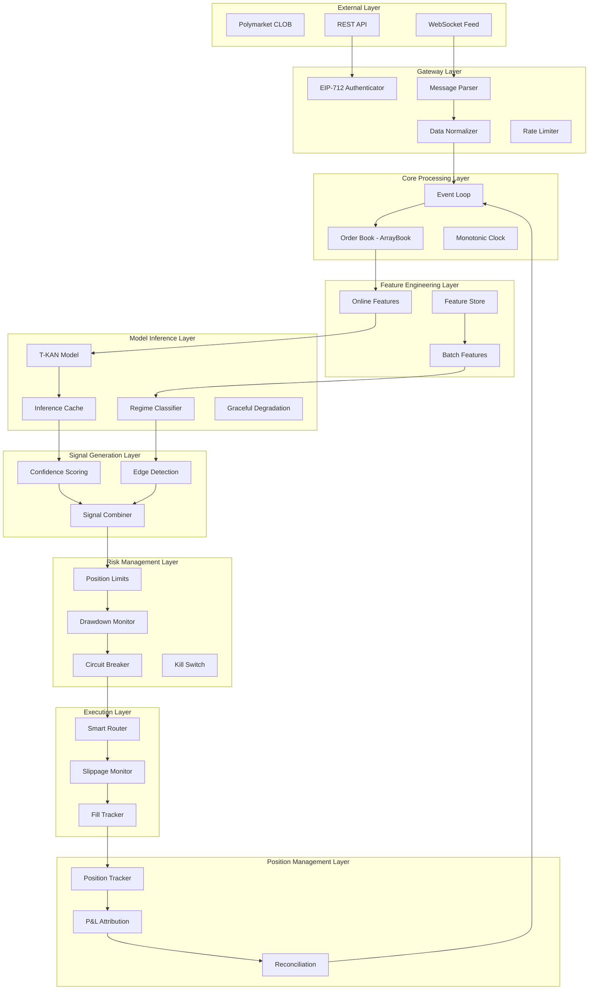
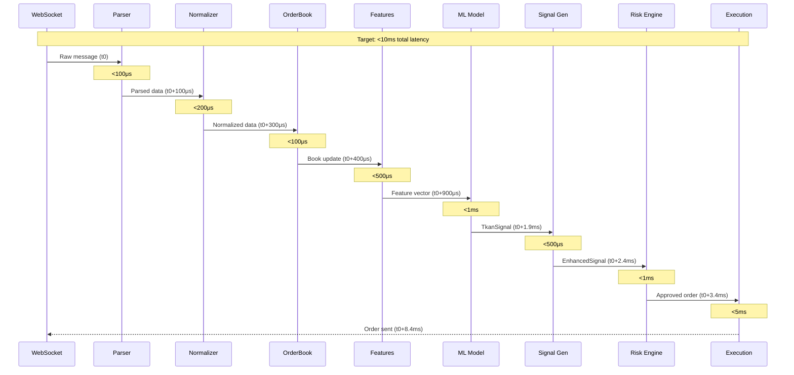

# Alpha-Generating Quantitative Trading System
## Technical Specification for MTrader Production System

**Document Version:** 1.0  
**Date:** 2026-01-11  
**Status:** Design Specification  
**System:** MTrader - Institutional-Grade Polymarket Trading Platform

---

## Executive Summary

This document provides a comprehensive technical specification for constructing an alpha-generating quantitative trading system in Rust, designed for production deployment with institutional-grade reliability. The system builds upon the existing MTrader codebase (~70% complete) and incorporates novel machine learning techniques, advanced signal generation, and robust risk management.

### System State
- **Current Completion:** 70%
- **Test Coverage:** 161 passing unit tests across 13 crates
- **Core Capabilities:** T-KAN ML integration, Strategy engine, Exchange connectivity, Paper trading, Risk management
- **Target:** Production-ready alpha-generating system with <10ms latency

---

## Table of Contents

1. [Repository Analysis Framework](#1-repository-analysis-framework)
2. [Trading System Architecture](#2-trading-system-architecture)
3. [Research Integration Framework](#3-research-integration-framework)
4. [Live Trading Pipeline](#4-live-trading-pipeline)
5. [Data Collection Infrastructure](#5-data-collection-infrastructure)
6. [Backtesting Engine Specification](#6-backtesting-engine-specification)
7. [Novel Signal Generation Research](#7-novel-signal-generation-research)
8. [Implementation Roadmap](#8-implementation-roadmap)

---

## 1. Repository Analysis Framework

### 1.1 Conceptual Analysis of Reference Architectures

This section analyzes architectural patterns from reference repositories to inform MTrader's design, without requiring direct code access.

#### 1.1.1 Neural Network Training (jw1912/bullet)

**Architectural Patterns:**
- Gradient descent optimization with batched training
- Checkpointing for incremental model improvement
- Separate training and inference pipelines
- Feature normalization at dataset level

**Application to MTrader:**
```rust
// crates/ml/src/trainer.rs (NEW)

pub struct TrainingPipeline {
    model: TkanModel,
    optimizer: AdamOptimizer,
    checkpoint_dir: PathBuf,
    batch_size: usize,
}

impl TrainingPipeline {
    /// Train model on historical trade outcomes
    pub fn train(
        &mut self,
        dataset: &TrainingDataset,
        config: TrainingConfig,
    ) -> Result<TrainingMetrics> {
        // Batch gradient descent
        // Checkpoint every N iterations
        // Early stopping on validation loss
        // Export model weights to JSON for inference
    }
}
```

**Integration Points:**
- [`crates/ml/src/lib.rs`](../crates/ml/src/lib.rs) - Extend TkanModel for training mode
- [`crates/data_pipeline/src/dataset.rs`](../crates/data_pipeline/src/dataset.rs) - NEW: Dataset preparation

#### 1.1.2 ML Inference Framework (huggingface/candle)

**Architectural Patterns:**
- Zero-copy tensor operations for sub-millisecond latency
- CUDA/Metal acceleration with CPU fallback
- Model quantization for memory efficiency
- Warm caching of loaded models

**Application to MTrader:**
```rust
// crates/ml/src/inference.rs (NEW)

pub struct InferenceEngine {
    model: TkanModel,
    cache: FeatureCache,
    device: Device,  // CPU | CUDA | Metal
}

impl InferenceEngine {
    /// Run inference with latency budget
    pub fn predict_with_budget(
        &self,
        features: &FeatureVector,
        max_latency_ns: u64,
    ) -> Result<TkanSignal> {
        let start = Instant::now();
        
        // Check cache for recent inference
        if let Some(cached) = self.cache.get(features) {
            return Ok(cached);
        }
        
        // Run inference
        let signal = self.model.predict(features);
        
        // Verify latency budget
        if start.elapsed().as_nanos() as u64 > max_latency_ns {
            tracing::warn!("Inference exceeded latency budget");
        }
        
        self.cache.insert(features.clone(), signal.clone());
        Ok(signal)
    }
}
```

**Target Latencies:**
- Model load: <100ms
- Single inference: <1ms
- Feature extraction: <500μs
- Total signal generation: <5ms

#### 1.1.3 Softmax Classification (rustmax-classifier, softmax repos)

**Architectural Patterns:**
- Multi-class probability distribution outputs
- Temperature scaling for confidence calibration
- Softmax normalization ensuring sum-to-one

**Application to MTrader:**
```rust
// crates/ml/src/classification.rs (NEW)

/// Market regime classifier using softmax
pub struct RegimeClassifier {
    weights: LayerWeights,
    temperature: f64,
}

#[derive(Debug, Clone)]
pub enum MarketRegime {
    TrendingUp,      // Prob: 0.0-1.0
    TrendingDown,    // Prob: 0.0-1.0
    RangeBound,      // Prob: 0.0-1.0
    HighVolatility,  // Prob: 0.0-1.0
}

impl RegimeClassifier {
    /// Classify current market regime with confidence
    pub fn classify(&self, features: &[f64]) -> RegimeDistribution {
        let logits = self.compute_logits(features);
        let probs = softmax_with_temperature(&logits, self.temperature);
        
        RegimeDistribution {
            trending_up: probs[0],
            trending_down: probs[1],
            range_bound: probs[2],
            high_volatility: probs[3],
        }
    }
    
    fn compute_logits(&self, features: &[f64]) -> Vec<f64> {
        // Linear layer: W·x + b
        self.weights.weights.iter()
            .map(|w| {
                w.iter().zip(features).map(|(wi, xi)| wi * xi).sum::<f64>()
                    + w.last().unwrap()  // bias
            })
            .collect()
    }
}

fn softmax_with_temperature(logits: &[f64], temp: f64) -> Vec<f64> {
    let scaled: Vec<f64> = logits.iter().map(|x| x / temp).collect();
    let max = scaled.iter().cloned().fold(f64::NEG_INFINITY, f64::max);
    let exps: Vec<f64> = scaled.iter().map(|x| (x - max).exp()).collect();
    let sum: f64 = exps.iter().sum();
    exps.iter().map(|e| e / sum).collect()
}
```

#### 1.1.4 Large-Margin Softmax Loss (wy1iu/LargeMargin_Softmax_Loss)

**Architectural Patterns:**
- Margin-based loss function for improved class separation
- Angular softmax for directional signal discrimination
- Improved generalization over standard cross-entropy

**Application to MTrader:**
```rust
// crates/ml/src/loss.rs (NEW)

/// Large-margin loss for signal discrimination
pub fn large_margin_softmax_loss(
    predictions: &[f64],
    targets: &[u8],
    margin: f64,
) -> f64 {
    let mut loss = 0.0;
    
    for (pred, &target) in predictions.iter().zip(targets) {
        let target_idx = target as usize;
        
        // Apply margin to correct class
        let modified_logits: Vec<f64> = predictions.iter()
            .enumerate()
            .map(|(i, &logit)| {
                if i == target_idx {
                    logit - margin  // Increase difficulty for correct class
                } else {
                    logit
                }
            })
            .collect();
        
        let softmax = softmax_with_temperature(&modified_logits, 1.0);
        loss += -softmax[target_idx].ln();
    }
    
    loss / predictions.len() as f64
}
```

**Benefits for Signal Generation:**
- Better separation between bullish/bearish/neutral signals
- Reduced false positives in low-confidence scenarios
- Improved edge detection in noisy markets

#### 1.1.5 Backtesting Architecture (jerryshell/midas)

**Architectural Patterns:**
- Event-driven simulation with realistic ordering
- Separate data replay from strategy execution
- Fill simulation with queue position modeling

**Application to MTrader:**
```rust
// crates/sim/src/event_driven_backtest.rs (NEW)

pub struct EventDrivenBacktest {
    events: VecDeque<TimestampedEvent>,
    strategy: Box<dyn Strategy>,
    book: ArrayBook,
    fills: FillSimulator,
    recorder: PerformanceRecorder,
}

impl EventDrivenBacktest {
    /// Run backtest with event replay
    pub fn run(&mut self, config: BacktestConfig) -> BacktestReport {
        while let Some(event) = self.events.pop_front() {
            match event.data {
                EventData::BookUpdate(update) => {
                    self.book.apply_update(&update);
                    let ctx = self.build_context();
                    let actions = self.strategy.on_update(&ctx);
                    self.execute_actions(actions, event.timestamp_ns);
                }
                EventData::Fill(fill) => {
                    self.strategy.on_fill(&ctx, fill.side, fill.price, fill.size);
                    self.recorder.record_fill(fill);
                }
                _ => {}
            }
        }
        
        self.recorder.generate_report()
    }
}
```

**Existing Integration:**
- [`crates/sim/src/recorded_backtest.rs`](../crates/sim/src/recorded_backtest.rs) - Current implementation
- Enhancement: Add event-driven loop for multi-strategy backtesting

#### 1.1.6 Multi-Asset Trading (declanomara/Investments)

**Architectural Patterns:**
- Position management across correlated assets
- Currency conversion and cross-market hedging
- Portfolio-level risk controls

**Application to MTrader:**
```rust
// crates/strategy/src/portfolio_manager.rs (NEW)

pub struct PortfolioManager {
    positions: HashMap<MarketId, Position>,
    correlations: CorrelationMatrix,
    risk_limits: PortfolioRiskLimits,
}

impl PortfolioManager {
    /// Calculate portfolio-level risk exposure
    pub fn calculate_portfolio_risk(&self) -> PortfolioRisk {
        let total_exposure = self.positions.values()
            .map(|pos| pos.notional_value())
            .sum();
        
        // Factor in correlations for true risk
        let correlation_adjusted_risk = self.calculate_correlated_risk();
        
        PortfolioRisk {
            total_exposure,
            correlation_adjusted_exposure: correlation_adjusted_risk,
            concentration: self.calculate_concentration(),
            diversification_ratio: correlation_adjusted_risk / total_exposure,
        }
    }
}
```

**Integration Points:**
- [`crates/strategy/src/traits.rs`](../crates/strategy/src/traits.rs) - Extend StrategyContext with portfolio view
- [`crates/risk/src/lib.rs`](../crates/risk/src/lib.rs) - Add portfolio-level limits

#### 1.1.7 Autonomous Trading Systems (SnowCheetos/AutoMoonBot)

**Architectural Patterns:**
- Strategy evolution with performance-based selection
- Automated parameter tuning
- Self-monitoring with automatic fallback

**Application to MTrader:**
```rust
// crates/strategy/src/evolution.rs (NEW)

pub struct StrategyEvolution {
    population: Vec<StrategyVariant>,
    fitness_tracker: FitnessTracker,
    mutation_rate: f64,
}

impl StrategyEvolution {
    /// Evolve strategy parameters based on performance
    pub fn evolve_generation(&mut self) -> StrategyVariant {
        // Select top performers
        let survivors = self.select_survivors(0.3);
        
        // Mutate parameters
        let mutants = survivors.iter()
            .map(|s| self.mutate(s))
            .collect();
        
        // Cross-breed strategies
        let offspring = self.crossover(&survivors);
        
        // Combine for new generation
        self.population = [survivors, mutants, offspring].concat();
        
        self.population[0].clone()  // Return best
    }
    
    fn mutate(&self, strategy: &StrategyVariant) -> StrategyVariant {
        // Gaussian mutation on continuous parameters
        // Random selection for discrete parameters
    }
}
```

**Use Cases:**
- Automatic strategy parameter tuning
- A/B testing multiple strategy variants
- Adapting to regime changes

---

## 2. Trading System Architecture

### 2.1 Component Boundary Specification



### 2.2 Data Contracts

#### 2.2.1 Market Data Ingestion

```rust
// crates/core/src/data_contracts.rs (NEW)

/// Normalized market data contract
#[derive(Debug, Clone, Serialize, Deserialize)]
pub struct NormalizedMarketData {
    // Identifiers
    pub market_id: MarketId,
    pub token_id: TokenId,
    
    // Timestamps (three-timestamp protocol)
    pub ts_exchange_ms: i64,
    pub ts_recv_mono_ns: i64,
    pub ts_process_mono_ns: i64,
    
    // Book state
    pub best_bid: Option<Tick>,
    pub best_bid_size: Size,
    pub best_ask: Option<Tick>,
    pub best_ask_size: Size,
    pub mid_price: Option<Tick>,
    pub spread_ticks: Option<u16>,
    
    // Derived metrics
    pub imbalance_ratio: f64,  // bid_size / (bid_size + ask_size)
    pub effective_spread_bps: u16,
    pub microstructure_noise: f64,
    
    // Quality indicators
    pub is_crossed: bool,
    pub is_stale: bool,
    pub staleness_ms: u64,
}

impl NormalizedMarketData {
    /// Validate data quality
    pub fn validate(&self) -> Result<(), ValidationError> {
        if self.is_crossed {
            return Err(ValidationError::CrossedBook);
        }
        if self.staleness_ms > 1000 {
            return Err(ValidationError::StaleData);
        }
        Ok(())
    }
}
```

#### 2.2.2 Feature Engineering Pipeline

```rust
// crates/ml/src/features.rs (NEW)

/// Online feature extraction (hot path)
pub struct OnlineFeatureExtractor {
    window: FeatureWindow,
    ema_tracker: EmaTracker,
}

impl OnlineFeatureExtractor {
    /// Extract features with <500μs latency
    pub fn extract(&mut self, data: &NormalizedMarketData) -> FeatureVector {
        let mut features = Vec::with_capacity(32);
        
        // Price features
        features.push(data.mid_price.unwrap_or(5000) as f64 / 10000.0);
        features.extend(self.window.price_returns(5));  // 5-period returns
        
        // Spread features
        features.push(data.spread_ticks.unwrap_or(20) as f64 / 10000.0);
        features.push(data.effective_spread_bps as f64 / 10000.0);
        
        // Volume features
        features.push(data.imbalance_ratio);
        features.extend(self.ema_tracker.volume_emas());
        
        // Momentum features
        features.extend(self.calculate_momentum_indicators());
        
        FeatureVector {
            features,
            timestamp_ns: data.ts_process_mono_ns as u64,
        }
    }
}

/// Batch feature extraction (offline)
pub struct BatchFeatureExtractor {
    lookback_periods: Vec<usize>,
}

impl BatchFeatureExtractor {
    /// Extract features for backtesting/training
    pub fn extract_batch(&self, history: &[MarketSnapshot]) -> Vec<FeatureVector> {
        history.par_iter()  // Parallel processing
            .map(|snapshot| self.extract_single(snapshot))
            .collect()
    }
}
```

#### 2.2.3 Model Inference Protocol

```rust
// crates/ml/src/inference_protocol.rs (NEW)

/// Inference request with degradation policy
pub struct InferenceRequest {
    pub features: FeatureVector,
    pub latency_budget_ns: u64,
    pub fallback_policy: FallbackPolicy,
}

#[derive(Debug, Clone)]
pub enum FallbackPolicy {
    UseLastSignal,
    UseNeutral,
    SkipTrade,
}

/// Inference response with metadata
pub struct InferenceResponse {
    pub signal: TkanSignal,
    pub latency_ns: u64,
    pub cache_hit: bool,
    pub model_version: String,
}

impl InferenceEngine {
    /// Inference with graceful degradation
    pub async fn infer_with_degradation(
        &self,
        request: InferenceRequest,
    ) -> Result<InferenceResponse> {
        let start = Instant::now();
        
        // Try cache first
        if let Some(cached) = self.cache.get(&request.features) {
            return Ok(InferenceResponse {
                signal: cached,
                latency_ns: start.elapsed().as_nanos() as u64,
                cache_hit: true,
                model_version: self.model_version.clone(),
            });
        }
        
        // Try model inference
        match timeout(
            Duration::from_nanos(request.latency_budget_ns),
            self.model.predict(&request.features),
        ).await {
            Ok(signal) => Ok(InferenceResponse {
                signal,
                latency_ns: start.elapsed().as_nanos() as u64,
                cache_hit: false,
                model_version: self.model_version.clone(),
            }),
            Err(_) => {
                // Latency budget exceeded - apply fallback
                tracing::warn!("Inference timeout, applying fallback");
                self.apply_fallback(request.fallback_policy)
            }
        }
    }
}
```

#### 2.2.4 Signal Generation with Confidence

```rust
// crates/strategy/src/signal_protocol.rs (NEW)

/// Enhanced trading signal with confidence and regime
#[derive(Debug, Clone)]
pub struct EnhancedSignal {
    // Core signal
    pub direction: SignalDirection,
    pub confidence: f64,
    pub edge_ticks: i16,
    
    // Regime context
    pub regime: MarketRegime,
    pub regime_confidence: f64,
    
    // Attribution
    pub source: SignalSource,
    pub features_used: Vec<String>,
    
    // Execution hints
    pub urgency: Urgency,
    pub suggested_size: Size,
    pub max_slippage_bps: u16,
    
    // Timestamps
    pub signal_timestamp_ns: u64,
    pub valid_until_ns: u64,
}

#[derive(Debug, Clone)]
pub enum SignalSource {
    MlModel { model_version: String },
    TechnicalIndicator { indicator: String },
    Arbitrage { arb_type: String },
    Composite { components: Vec<SignalSource> },
}

#[derive(Debug, Clone, Copy)]
pub enum Urgency {
    Low,     // Can wait for better price
    Medium,  // Execute within 1 second
    High,    // Execute immediately (arb opportunity)
}
```

#### 2.2.5 Risk Management Protocol

```rust
// crates/risk/src/protocol.rs (NEW)

/// Risk check request
pub struct RiskCheckRequest {
    pub signal: EnhancedSignal,
    pub current_position: Position,
    pub current_pnl: PnLSnapshot,
    pub market_state: MarketState,
}

/// Risk check response
pub struct RiskCheckResponse {
    pub approved: bool,
    pub rejection_reason: Option<RiskRejection>,
    pub adjusted_size: Option<Size>,
    pub warnings: Vec<RiskWarning>,
}

#[derive(Debug, Clone)]
pub enum RiskRejection {
    PositionLimitExceeded { current: i64, limit: i64 },
    DrawdownLimitExceeded { current_pct: f64, limit_pct: f64 },
    CircuitBreakerActive { reason: String },
    InsufficientConfidence { confidence: f64, required: f64 },
    InsufficientEdge { edge_ticks: i16, required: u16 },
    DailyLossLimitReached,
}

impl RiskEngine {
    /// Multi-layer risk check
    pub fn check_signal(&self, request: &RiskCheckRequest) -> RiskCheckResponse {
        let mut warnings = Vec::new();
        
        // Layer 1: Position limits
        if let Err(e) = self.limits.check_position_limit(&request) {
            return RiskCheckResponse::rejected(e);
        }
        
        // Layer 2: Drawdown controls
        if let Err(e) = self.drawdown.check_drawdown(&request) {
            return RiskCheckResponse::rejected(e);
        }
        
        // Layer 3: Circuit breaker
        if let Err(e) = self.circuit_breaker.check() {
            return RiskCheckResponse::rejected(e);
        }
        
        // Layer 4: Confidence threshold
        if request.signal.confidence < self.config.min_confidence {
            return RiskCheckResponse::rejected(
                RiskRejection::InsufficientConfidence {
                    confidence: request.signal.confidence,
                    required: self.config.min_confidence,
                }
            );
        }
        
        // Approve with potential size adjustment
        let adjusted_size = self.calculate_safe_size(&request);
        
        RiskCheckResponse {
            approved: true,
            rejection_reason: None,
            adjusted_size: Some(adjusted_size),
            warnings,
        }
    }
}
```

#### 2.2.6 Order Execution Protocol

```rust
// crates/execution/src/protocol.rs (NEW)

/// Smart order execution request
pub struct ExecutionRequest {
    pub signal: EnhancedSignal,
    pub approved_size: Size,
    pub risk_constraints: RiskConstraints,
}

/// Execution response with slippage tracking
pub struct ExecutionResponse {
    pub order_id: String,
    pub client_order_id: ClientOrderId,
    pub status: ExecutionStatus,
    pub fills: Vec<FillReport>,
    pub total_slippage_bps: f64,
    pub latency_ms: u64,
}

pub struct SmartRouter {
    slippage_monitor: SlippageMonitor,
    retry_policy: RetryPolicy,
}

impl SmartRouter {
    /// Route order with slippage monitoring
    pub async fn route_order(
        &self,
        request: ExecutionRequest,
    ) -> Result<ExecutionResponse> {
        let start = Instant::now();
        
        // Calculate optimal execution strategy
        let strategy = self.calculate_execution_strategy(&request);
        
        // Execute with monitoring
        let fills = self.execute_with_monitoring(strategy).await?;
        
        // Calculate slippage
        let total_slippage = self.slippage_monitor.calculate_slippage(
            &fills,
            request.signal.edge_ticks,
        );
        
        Ok(ExecutionResponse {
            order_id: fills[0].order_id.clone(),
            client_order_id: fills[0].client_order_id.clone(),
            status: ExecutionStatus::Filled,
            fills,
            total_slippage_bps: total_slippage,
            latency_ms: start.elapsed().as_millis() as u64,
        })
    }
}
```

#### 2.2.7 Position Management & P&L Attribution

```rust
// crates/risk/src/position_protocol.rs (NEW)

/// Position with full attribution
pub struct AttributedPosition {
    pub position: Position,
    pub entry_signal: EnhancedSignal,
    pub entry_fills: Vec<FillReport>,
    pub current_pnl: i64,
    pub unrealized_pnl: i64,
    pub realized_pnl: i64,
    pub fees_paid: u64,
    pub holding_period_ms: u64,
    pub attribution: PnLAttribution,
}

#[derive(Debug, Clone)]
pub struct PnLAttribution {
    pub signal_contribution: f64,  // How much did signal quality contribute
    pub timing_contribution: f64,  // How much did execution timing contribute
    pub slippage_cost: f64,
    pub fee_cost: f64,
    pub market_move: f64,
}

impl PositionManager {
    /// Calculate P&L attribution
    pub fn calculate_attribution(
        &self,
        position: &AttributedPosition,
        exit_price: Tick,
    ) -> PnLAttribution {
        let entry_avg = position.entry_fills.iter()
            .map(|f| f.price_tick as f64 * f.size as f64)
            .sum::<f64>() / position.entry_fills.iter()
            .map(|f| f.size as f64)
            .sum::<f64>();
        
        let signal_predicted_price = position.entry_signal.edge_ticks as f64 
            + entry_avg;
        
        PnLAttribution {
            signal_contribution: (exit_price as f64 - signal_predicted_price) 
                * position.position.size as f64,
            timing_contribution: (entry_avg - position.entry_signal.edge_ticks as f64) 
                * position.position.size as f64,
            slippage_cost: position.entry_fills.iter()
                .map(|f| f.slippage_bps as f64)
                .sum::<f64>(),
            fee_cost: position.fees_paid as f64,
            market_move: (exit_price as f64 - entry_avg) 
                * position.position.size as f64,
        }
    }
}
```

### 2.3 Inter-Component Protocols

#### Data Flow Timing Diagram



---

## 3. Research Integration Framework

### 3.1 T-KAN (Temporal Kolmogorov-Arnold Network)

#### Mathematical Specification

The T-KAN model approximates temporal patterns using a SiLU-based MLP architecture:

**Input Layer:**
- Window size: 20 time steps
- Features per step: price return, spread, volume proxy
- Total input dimension: 22 (20 price features + spread + volatility)

**Hidden Layer (SiLU Activation):**
```
h = SiLU(W₁·x + b₁)
SiLU(x) = x / (1 + e^(-x))
```

**Output Layer:**
```
[direction, confidence] = W₂·h + b₂
direction ∈ [-1, 1]  (bearish to bullish)
confidence = σ(raw_confidence) ∈ [0, 1]
```

#### Training Data Requirements

```rust
// crates/ml/src/training_data.rs (NEW)

pub struct TrainingDataRequirements {
    pub min_samples: usize,              // 10,000
    pub min_positive_samples: usize,     // 3,000
    pub min_negative_samples: usize,     // 3,000
    pub lookback_periods: Vec<usize>,    // [5, 10, 20, 50]
    pub target_horizon_ms: u64,          // 60,000 (1 minute)
    pub label_threshold_bps: f64,        // 5 bps for positive label
}

/// Generate training labels from trade outcomes
pub fn generate_labels(
    outcomes: &[TradeOutcome],
    threshold_bps: f64,
) -> Vec<TrainingLabel> {
    outcomes.iter()
        .filter(|o| o.holding_period_ms >= 10_000)  // Min 10s hold
        .map(|o| {
            let label = if o.pnl_bps > threshold_bps {
                1.0  // Win
            } else if o.pnl_bps < -threshold_bps {
                -1.0  // Loss
            } else {
                0.0  // Neutral
            };
            
            TrainingLabel {
                features: o.signal_features.clone(),
                label,
                weight: calculate_sample_weight(o),
                timestamp: o.signal_timestamp_ns,
            }
        })
        .collect()
}
```

### 3.2 Large-Margin Softmax for Signal Discrimination

#### Integration Architecture

```rust
// crates/ml/src/margin_softmax.rs (NEW)

/// Large-margin softmax for improved signal separation
pub struct MarginSoftmaxClassifier {
    input_layer: LayerWeights,
    hidden_layer: LayerWeights,
    margin: f64,  // Typically 0.3-0.5
}

impl MarginSoftmaxClassifier {
    /// Train with large-margin loss
    pub fn train(
        &mut self,
        features: &[Vec<f64>],
        labels: &[u8],
        config: TrainingConfig,
    ) -> TrainingMetrics {
        let mut optimizer = AdamOptimizer::new(config.learning_rate);
        
        for epoch in 0..config.max_epochs {
            let mut epoch_loss = 0.0;
            
            for (batch_features, batch_labels) in 
                batch_iter(features, labels, config.batch_size) 
            {
                // Forward pass
                let predictions = self.forward(batch_features);
                
                // Calculate large-margin loss
                let loss = self.large_margin_loss(&predictions, batch_labels);
                
                // Backward pass
                let gradients = self.backward(&predictions, batch_labels);
                
                // Update weights
                optimizer.step(&mut self.input_layer, &gradients.input);
                optimizer.step(&mut self.hidden_layer, &gradients.hidden);
                
                epoch_loss += loss;
            }
            
            // Early stopping check
            if epoch_loss < config.convergence_threshold {
                break;
            }
        }
        
        TrainingMetrics {
            final_loss: epoch_loss,
            epochs_trained: epoch,
            // ...
        }
    }
    
    fn large_margin_loss(&self, predictions: &[f64], labels: &[u8]) -> f64 {
        // Apply margin penalty to correct class
        // Forces model to produce higher confidence for correct predictions
        // Reduces overconfidence on ambiguous samples
    }
}
```

#### Benefits for Trading

1. **Reduced False Positives:** Margin forces model to only signal when highly confident
2. **Better Generalization:** Prevents overfitting to training distribution
3. **Improved Edge:** Higher signal quality leads to better risk-adjusted returns

### 3.3 Multi-Head Attention for Cross-Asset Correlation

```rust
// crates/ml/src/attention.rs (NEW)

/// Multi-head attention for cross-asset signals
pub struct MultiHeadAttention {
    num_heads: usize,
    head_dim: usize,
    query_weights: Vec<LayerWeights>,
    key_weights: Vec<LayerWeights>,
    value_weights: Vec<LayerWeights>,
}

impl MultiHeadAttention {
    /// Apply attention across multiple markets
    pub fn attend(
        &self,
        primary_features: &[f64],
        context_features: &[Vec<f64>],  // Other markets
    ) -> Vec<f64> {
        let mut attended_features = Vec::new();
        
        for head_idx in 0..self.num_heads {
            // Query from primary market
            let query = self.query_weights[head_idx]
                .apply(primary_features);
            
            // Keys and values from context markets
            let keys: Vec<_> = context_features.iter()
                .map(|f| self.key_weights[head_idx].apply(f))
                .collect();
            
            let values: Vec<_> = context_features.iter()
                .map(|f| self.value_weights[head_idx].apply(f))
                .collect();
            
            // Attention scores
            let scores: Vec<f64> = keys.iter()
                .map(|k| dot_product(&query, k) / (self.head_dim as f64).sqrt())
                .collect();
            
            let attention_weights = softmax(&scores);
            
            // Attended value
            let attended = weighted_sum(&values, &attention_weights);
            attended_features.extend(attended);
        }
        
        attended_features
    }
}
```

**Use Cases:**
- Detect correlation breakdowns (arbitrage opportunities)
- Cross-market momentum signals
- Regime-conditional correlation analysis

### 3.4 Uncertainty Quantification for Position Sizing

```rust
// crates/ml/src/uncertainty.rs (NEW)

/// Monte Carlo dropout for uncertainty estimation
pub struct UncertaintyQuantifier {
    model: TkanModel,
    num_samples: usize,  // 10-20 samples
    dropout_rate: f64,   // 0.1-0.2
}

impl UncertaintyQuantifier {
    /// Estimate prediction uncertainty
    pub fn estimate_uncertainty(
        &self,
        features: &FeatureVector,
    ) -> UncertaintyEstimate {
        let mut predictions = Vec::with_capacity(self.num_samples);
        
        // Multiple forward passes with dropout
        for _ in 0..self.num_samples {
            let signal = self.model.predict_with_dropout(
                features,
                self.dropout_rate,
            );
            predictions.push(signal.direction);
        }
        
        // Calculate statistics
        let mean = predictions.iter().sum::<f64>() / predictions.len() as f64;
        let variance = predictions.iter()
            .map(|p| (p - mean).powi(2))
            .sum::<f64>() / predictions.len() as f64;
        let std_dev = variance.sqrt();
        
        UncertaintyEstimate {
            mean_prediction: mean,
            std_dev,
            confidence_interval_95: (mean - 1.96 * std_dev, mean + 1.96 * std_dev),
            epistemic_uncertainty: std_dev,
        }
    }
    
    /// Calculate position size based on uncertainty
    pub fn calculate_kelly_size(
        &self,
        uncertainty: &UncertaintyEstimate,
        edge_ticks: i16,
        max_size: Size,
    ) -> Size {
        // Kelly criterion with uncertainty adjustment
        let win_prob = self.estimate_win_probability(uncertainty);
        let edge = edge_ticks as f64 / 10000.0;
        
        let kelly_fraction = (win_prob * (1.0 + edge) - (1.0 - win_prob)) / edge;
        
        // Reduce size by uncertainty factor
        let uncertainty_factor = 1.0 / (1.0 + uncertainty.std_dev);
        
        let adjusted_fraction = kelly_fraction * uncertainty_factor * 0.5;  // Half-Kelly
        
        ((max_size as f64) * adjusted_fraction.clamp(0.0, 1.0)) as Size
    }
}
```

---

## 4. Live Trading Pipeline

### 4.1 Real-Time Data Flow Architecture


### 4.2 Latency Budget Specification

| Component | Target Latency | P50 | P99 | P99.9 |
|-----------|---------------|-----|-----|-------|
| WebSocket → Parse | 100μs | 80μs | 150μs | 300μs |
| Parse → Normalize | 200μs | 150μs | 300μs | 500μs |
| Normalize → Book | 100μs | 80μs | 150μs | 250μs |
| Book → Features | 500μs | 400μs | 700μs | 1ms |
| Features → ML | 1ms | 800μs | 1.5ms | 3ms |
| ML → Signal | 500μs | 400μs | 700μs | 1ms |
| Signal → Risk | 1ms | 800μs | 1.5ms | 2ms |
| Risk → Order | 5ms | 4ms | 7ms | 10ms |
| **Total Pipeline** | **<10ms** | **8ms** | **12ms** | **18ms** |

### 4.3 Failure Detection and Recovery

```rust
// crates/core/src/health_monitor.rs (NEW)

pub struct HealthMonitor {
    latency_tracker: LatencyTracker,
    error_tracker: ErrorTracker,
    circuit_breaker: Arc<CircuitBreaker>,
    alert_manager: Arc<AlertManager>,
}

impl HealthMonitor {
    /// Monitor pipeline health
    pub fn monitor_pipeline(&mut self, event: &PipelineEvent) {
        // Track latency
        if event.latency_ns > self.config.latency_threshold_ns {
            self.latency_tracker.record_violation(event);
            
            if self.latency_tracker.violation_rate() > 0.05 {
                // >5% violations - degrade
                self.trigger_degradation(DegradationReason::HighLatency);
            }
        }
        
        // Track errors
        if event.is_error() {
            self.error_tracker.record_error(event);
            
            if self.error_tracker.error_rate() > 0.01 {
                // >1% error rate - circuit break
                self.circuit_breaker.trip(TripReason::HighErrorRate);
                self.alert_manager.send_critical_alert(
                    "Pipeline error rate exceeded threshold"
                );
            }
        }
    }
    
    fn trigger_degradation(&self, reason: DegradationReason) {
        match reason {
            DegradationReason::HighLatency => {
                // Disable ML inference, use simple signals
                tracing::warn!("High latency detected, disabling ML");
            }
            DegradationReason::HighErrorRate => {
                // Switch to paper trading mode
                tracing::error!("High error rate, switching to paper mode");
            }
        }
    }
}
```

### 4.4 Position Reconciliation Protocols

```rust
// crates/risk/src/reconciliation.rs (NEW)

pub struct PositionReconciliation {
    internal_positions: HashMap<MarketId, Position>,
    exchange_positions: HashMap<MarketId, Position>,
    reconciliation_interval_ms: u64,
}

impl PositionReconciliation {
    /// Reconcile positions with exchange
    pub async fn reconcile(&mut self) -> ReconciliationReport {
        let exchange_positions = self.fetch_exchange_positions().await?;
        
        let mut discrepancies = Vec::new();
        
        for (market_id, internal_pos) in &self.internal_positions {
            if let Some(exchange_pos) = exchange_positions.get(market_id) {
                if internal_pos.size != exchange_pos.size {
                    discrepancies.push(PositionDiscrepancy {
                        market_id: market_id.clone(),
                        internal_size: internal_pos.size,
                        exchange_size: exchange_pos.size,
                        delta: exchange_pos.size - internal_pos.size,
                    });
                }
            }
        }
        
        // Auto-correct small discrepancies
        for discrepancy in &discrepancies {
            if discrepancy.delta.abs() < 1_000_000 {  // < 1 share
                self.correct_position(discrepancy);
            } else {
                // Large discrepancy - alert and halt
                self.alert_manager.send_critical_alert(&format!(
                    "Large position discrepancy: {:?}",
                    discrepancy
                ));
                self.circuit_breaker.trip(TripReason::PositionDiscrepancy);
            }
        }
        
        ReconciliationReport {
            discrepancies,
            corrected_count: discrepancies.len(),
            timestamp: SystemTime::now(),
        }
    }
}
```

### 4.5 Monitoring Instrumentation

```rust
// crates/monitoring/src/metrics.rs (NEW)

/// Prometheus metrics for monitoring
pub struct TradingMetrics {
    // Latency metrics
    pub pipeline_latency: HistogramVec,
    pub inference_latency: Histogram,
    pub execution_latency: Histogram,
    
    // Throughput metrics
    pub messages_processed: Counter,
    pub signals_generated: Counter,
    pub orders_sent: Counter,
    
    // Quality metrics
    pub signal_confidence: Histogram,
    pub edge_quality: Histogram,
    pub fill_quality: Histogram,
    
    // Risk metrics
    pub position_utilization: Gauge,
    pub drawdown_current: Gauge,
    pub circuit_breaker_status: Gauge,
    
    // P&L metrics
    pub realized_pnl: Counter,
    pub unrealized_pnl: Gauge,
    pub total_fees: Counter,
}

impl TradingMetrics {
    /// Record pipeline event
    pub fn record_pipeline_event(&self, event: &PipelineEvent) {
        self.pipeline_latency
            .with_label_values(&[&event.stage])
            .observe(event.latency_ns as f64 / 1_000_000.0);  // Convert to ms
        
        self.messages_processed.inc();
    }
    
    /// Export metrics for Prometheus
    pub fn export(&self) -> String {
        // Export in Prometheus format
        prometheus::TextEncoder::new()
            .encode_to_string(&self.registry)
            .unwrap()
    }
}
```

---

## 5. Data Collection Infrastructure

### 5.1 Historical Data Storage Architecture

```rust
// crates/data_pipeline/src/storage.rs (NEW)

/// Time-series optimized storage
pub struct TimeSeriesStorage {
    parquet_writer: ParquetWriter,
    compression: Compression,
    partition_strategy: PartitionStrategy,
}

#[derive(Debug, Clone)]
pub enum PartitionStrategy {
    ByDay,
    ByHour,
    ByMarket,
    ByMarketAndDay,
}

impl TimeSeriesStorage {
    /// Store market data snapshot
    pub async fn store_snapshot(
        &mut self,
        snapshot: &MarketSnapshot,
    ) -> Result<()> {
        let partition_key = self.partition_strategy.compute_key(snapshot);
        
        let record = SnapshotRecord {
            timestamp_ns: snapshot.timestamp_ns,
            market_id: snapshot.market_id.clone(),
            token_id: snapshot.token_id.clone(),
            best_bid: snapshot.best_bid,
            best_ask: snapshot.best_ask,
            mid_price: snapshot.mid_price,
            spread_ticks: snapshot.spread_ticks,
            imbalance_ratio: snapshot.imbalance_ratio,
        };
        
        self.parquet_writer.write_batch(
            &partition_key,
            vec![record],
        ).await?;
        
        Ok(())
    }
    
    /// Query time-series data
    pub async fn query(
        &self,
        query: TimeSeriesQuery,
    ) -> Result<Vec<MarketSnapshot>> {
        let partitions = self.partition_strategy.find_partitions(&query);
        
        let mut results = Vec::new();
        
        for partition in partitions {
            let partition_data = self.parquet_writer
                .read_partition(&partition)
                .await?;
            
            results.extend(
                partition_data.into_iter()
                    .filter(|record| query.matches(record))
            );
        }
        
        // Sort by timestamp
        results.sort_by_key(|s| s.timestamp_ns);
        
        Ok(results)
    }
}

#[derive(Debug, Clone)]
pub struct TimeSeriesQuery {
    pub market_ids: Vec<MarketId>,
    pub start_time_ns: u64,
    pub end_time_ns: u64,
    pub sample_rate_ms: Option<u64>,  // Downsample if specified
}
```

### 5.2 Real-Time Streaming with Guaranteed Delivery

```rust
// crates/data_pipeline/src/streaming.rs (NEW)

/// Real-time streaming with at-least-once delivery
pub struct StreamingPipeline {
    kafka_producer: KafkaProducer,
    redis_cache: RedisClient,
    wal: WriteAheadLog,
}

impl StreamingPipeline {
    /// Stream event with guaranteed delivery
    pub async fn stream_event(&mut self, event: &CoreEvent) -> Result<()> {
        // Write to WAL first
        self.wal.append(event).await?;
        
        // Try Kafka
        match self.kafka_producer.send(event).await {
            Ok(_) => {
                // Success - mark WAL entry as committed
                self.wal.commit(event.id).await?;
                Ok(())
            }
            Err(e) => {
                // Failed - will retry from WAL
                tracing::warn!("Failed to stream event: {:?}", e);
                Err(e)
            }
        }
    }
    
    /// Replay uncommitted events from WAL
    pub async fn replay_wal(&mut self) -> Result<usize> {
        let uncommitted = self.wal.uncommitted_events().await?;
        
        let mut replayed = 0;
        
        for event in uncommitted {
            if self.kafka_producer.send(&event).await.is_ok() {
                self.wal.commit(event.id).await?;
                replayed += 1;
            }
        }
        
        Ok(replayed)
    }
}
```

### 5.3 Feature Store for Consistent Features

```rust
// crates/data_pipeline/src/feature_store.rs (NEW)

/// Feature store for consistent backtest/live features
pub struct FeatureStore {
    online_cache: LruCache<FeatureKey, FeatureVector>,
    offline_storage: TimeSeriesStorage,
    extractor: OnlineFeatureExtractor,
}

impl FeatureStore {
    /// Get features for backtesting (consistent with live)
    pub async fn get_features_batch(
        &self,
        market_id: &MarketId,
        timestamps: &[u64],
    ) -> Result<Vec<FeatureVector>> {
        // Try cache first
        let mut features = Vec::with_capacity(timestamps.len());
        let mut missing = Vec::new();
        
        for &ts in timestamps {
            let key = FeatureKey::new(market_id.clone(), ts);
            
            if let Some(cached) = self.online_cache.get(&key) {
                features.push(cached.clone());
            } else {
                missing.push(ts);
            }
        }
        
        // Fetch missing from storage
        if !missing.is_empty() {
            let snapshots = self.offline_storage.query(
                TimeSeriesQuery {
                    market_ids: vec![market_id.clone()],
                    start_time_ns: *missing.first().unwrap(),
                    end_time_ns: *missing.last().unwrap(),
                    sample_rate_ms: None,
                }
            ).await?;
            
            // Extract features
            for snapshot in snapshots {
                let feature_vec = self.extractor.extract(&snapshot);
                features.push(feature_vec);
            }
        }
        
        Ok(features)
    }
    
    /// Store features for future retrieval
    pub async fn store_features(
        &mut self,
        market_id: &MarketId,
        features: FeatureVector,
    ) -> Result<()> {
        let key = FeatureKey::new(market_id.clone(), features.timestamp_ns);
        
        // Store in cache
        self.online_cache.put(key.clone(), features.clone());
        
        // Persist to storage asynchronously
        tokio::spawn({
            let storage = self.offline_storage.clone();
            let features = features.clone();
            async move {
                storage.store_features(&features).await
            }
        });
        
        Ok(())
    }
}
```

### 5.4 Data Quality Monitoring with Anomaly Detection

```rust
// crates/data_pipeline/src/quality.rs (NEW)

/// Data quality monitor
pub struct DataQualityMonitor {
    validators: Vec<Box<dyn DataValidator>>,
    anomaly_detector: AnomalyDetector,
    alert_manager: Arc<AlertManager>,
}

pub trait DataValidator: Send + Sync {
    fn validate(&self, data: &NormalizedMarketData) -> ValidationResult;
}

/// Price spike detector
pub struct PriceSpikeDetector {
    max_change_bps: u16,
    lookback_window: VecDeque<Tick>,
}

impl DataValidator for PriceSpikeDetector {
    fn validate(&self, data: &NormalizedMarketData) -> ValidationResult {
        if let Some(mid_price) = data.mid_price {
            if let Some(&prev_price) = self.lookback_window.back() {
                let change_bps = ((mid_price as f64 - prev_price as f64).abs() 
                    / prev_price as f64 * 10000.0) as u16;
                
                if change_bps > self.max_change_bps {
                    return ValidationResult::Warning(
                        format!("Price spike detected: {} bps", change_bps)
                    );
                }
            }
        }
        
        ValidationResult::Ok
    }
}

/// Anomaly detector using statistical methods
pub struct AnomalyDetector {
    zscore_threshold: f64,
    rolling_stats: RollingStatistics,
}

impl AnomalyDetector {
    /// Detect anomalies using z-score
    pub fn detect_anomaly(&mut self, value: f64) -> Option<Anomaly> {
        self.rolling_stats.update(value);
        
        let mean = self.rolling_stats.mean();
        let std_dev = self.rolling_stats.std_dev();
        
        if std_dev > 0.0 {
            let zscore = (value - mean) / std_dev;
            
            if zscore.abs() > self.zscore_threshold {
                return Some(Anomaly {
                    value,
                    zscore,
                    mean,
                    std_dev,
                    timestamp: SystemTime::now(),
                });
            }
        }
        
        None
    }
}
```

---

## 6. Backtesting Engine Specification

### 6.1 Event-Driven Simulation Architecture

```rust
// crates/sim/src/event_driven_backtest.rs (NEW)

/// Event-driven backtesting engine
pub struct EventDrivenBacktest {
    // State
    strategy: Box<dyn Strategy>,
    book: ArrayBook,
    position: Position,
    balance: i64,
    
    // Simulation
    fill_sim: RealisticFillSimulator,
    fee_model: FeeModel,
    slippage_model: SlippageModel,
    
    // Events
    events: PriorityQueue<TimestampedEvent>,
    
    // Recording
    recorder: BacktestRecorder,
}

impl EventDrivenBacktest {
    /// Run backtest on historical data
    pub fn run(
        mut self,
        config: BacktestConfig,
    ) -> BacktestReport {
        while let Some(event) = self.events.pop() {
            match event.data {
                EventData::BookSnapshot(snapshot) => {
                    self.process_book_snapshot(snapshot, event.timestamp_ns);
                }
                EventData::BookDelta(delta) => {
                    self.process_book_delta(delta, event.timestamp_ns);
                }
                EventData::Trade(trade) => {
                    self.process_trade(trade, event.timestamp_ns);
                }
                EventData::Fill(fill) => {
                    self.process_fill(fill, event.timestamp_ns);
                }
            }
            
            // Check stop conditions
            if self.should_stop(&config) {
                break;
            }
        }
        
        self.recorder.generate_report()
    }
    
    fn process_book_snapshot(
        &mut self,
        snapshot: BookSnapshot,
        timestamp_ns: u64,
    ) {
        // Update book
        self.book.apply_snapshot(&snapshot);
        
        // Build strategy context
        let ctx = StrategyContext::from_book(
            &self.book,
            snapshot.market_id,
            self.position.clone(),
            self.calculate_pnl(),
            vec![],  // our_bids
            vec![],  // our_asks
            HashMap::new(),  // market_snapshots
            timestamp_ns,
        );
        
        // Get strategy actions
        let actions = self.strategy.on_update(&ctx);
        
        // Execute actions
        for action in actions {
            self.execute_action(action, timestamp_ns);
        }
    }
    
    fn execute_action(&mut self, action: StrategyAction, timestamp_ns: u64) {
        match action {
            StrategyAction::PlaceOrder { side, kind, order_type, reason } => {
                // Simulate order placement
                let (price, size) = match kind {
                    OrderKind::Limit { price_tick, size } => (price_tick, size),
                    OrderKind::Market { size } => {
                        // Use best price
                        let price = match side {
                            Side::Buy => self.book.best_ask().unwrap_or(5000),
                            Side::Sell => self.book.best_bid().unwrap_or(5000),
                        };
                        (price, size)
                    }
                };
                
                // Simulate fill with realistic model
                if let Some(fill) = self.fill_sim.simulate_fill(
                    side,
                    price,
                    size,
                    &self.book,
                    timestamp_ns,
                ) {
                    // Schedule fill event
                    self.events.push(TimestampedEvent {
                        timestamp_ns: timestamp_ns + fill.fill_delay_ns,
                        data: EventData::Fill(fill),
                    });
                }
            }
            _ => {}
        }
    }
}
```

### 6.2 Realistic Fill Modeling

```rust
// crates/sim/src/realistic_fills.rs (NEW)

/// Realistic fill simulator with queue position
pub struct RealisticFillSimulator {
    config: FillSimConfig,
    queue_tracker: QueuePositionTracker,
}

#[derive(Debug, Clone)]
pub struct FillSimConfig {
    pub queue_processing_rate_shares_per_sec: u64,  // 10,000
    pub adverse_selection_prob: f64,                // 0.05
    pub partial_fill_prob: f64,                     // 0.1
    pub latency_mean_ms: u64,                       // 50ms
    pub latency_std_ms: u64,                        // 20ms
}

impl RealisticFillSimulator {
    /// Simulate order fill with realistic dynamics
    pub fn simulate_fill(
        &mut self,
        side: Side,
        price: Tick,
        size: Size,
        book: &ArrayBook,
        timestamp_ns: u64,
    ) -> Option<SimulatedFill> {
        // Check if order crosses spread
        let crosses_spread = match side {
            Side::Buy => Some(price) >= book.best_ask(),
            Side::Sell => Some(price) <= book.best_bid(),
        };
        
        if crosses_spread {
            // Taker order - immediate fill with adverse selection risk
            return self.simulate_taker_fill(side, price, size, book, timestamp_ns);
        } else {
            // Maker order - join queue
            return self.simulate_maker_fill(side, price, size, book, timestamp_ns);
        }
    }
    
    fn simulate_taker_fill(
        &mut self,
        side: Side,
        price: Tick,
        size: Size,
        book: &ArrayBook,
        timestamp_ns: u64,
    ) -> Option<SimulatedFill> {
        // Adverse selection check
        if fastrand::f64() < self.config.adverse_selection_prob {
            // No fill due to adverse selection
            return None;
        }
        
        // Calculate slippage
        let avg_fill_price = self.calculate_avg_fill_price(side, size, book);
        let slippage_bps = ((avg_fill_price as f64 - price as f64).abs() 
            / price as f64 * 10000.0) as u16;
        
        // Latency simulation
        let fill_delay_ns = self.sample_latency_ns();
        
        Some(SimulatedFill {
            side,
            price: avg_fill_price,
            size,
            is_maker: false,
            slippage_bps,
            fill_delay_ns,
            timestamp_ns: timestamp_ns + fill_delay_ns,
        })
    }
    
    fn simulate_maker_fill(
        &mut self,
        side: Side,
        price: Tick,
        size: Size,
        book: &ArrayBook,
        timestamp_ns: u64,
    ) -> Option<SimulatedFill> {
        // Join queue
        let queue_position = self.queue_tracker.join_queue(side, price, size);
        
        // Estimate fill time based on queue
        let shares_ahead = queue_position.shares_ahead;
        let estimated_fill_time_ms = (shares_ahead as f64 
            / self.config.queue_processing_rate_shares_per_sec as f64 
            * 1000.0) as u64;
        
        // Partial fill probability
        let fill_size = if fastrand::f64() < self.config.partial_fill_prob {
            size / 2  // Partial fill
        } else {
            size
        };
        
        Some(SimulatedFill {
            side,
            price,
            size: fill_size,
            is_maker: true,
            slippage_bps: 0,  // No slippage for maker
            fill_delay_ns: estimated_fill_time_ms * 1_000_000,
            timestamp_ns: timestamp_ns + estimated_fill_time_ms * 1_000_000,
        })
    }
    
    fn sample_latency_ns(&self) -> u64 {
        // Sample from normal distribution
        let z = self.box_muller_sample();
        let latency_ms = (self.config.latency_mean_ms as f64 
            + z * self.config.latency_std_ms as f64).max(1.0);
        (latency_ms * 1_000_000.0) as u64
    }
    
    fn box_muller_sample(&self) -> f64 {
        let u1 = fastrand::f64();
        let u2 = fastrand::f64();
        (-2.0 * u1.ln()).sqrt() * (2.0 * std::f64::consts::PI * u2).cos()
    }
}
```

### 6.3 Walk-Forward Optimization

```rust
// crates/sim/src/walk_forward.rs (NEW)

/// Walk-forward optimization for strategy parameters
pub struct WalkForwardOptimization {
    train_period_days: u32,
    test_period_days: u32,
    step_days: u32,
    parameter_grid: ParameterGrid,
}

impl WalkForwardOptimization {
    /// Run walk-forward optimization
    pub async fn optimize(
        &self,
        strategy_factory: StrategyFactory,
        data: &TimeSeriesData,
    ) -> WalkForwardReport {
        let mut results = Vec::new();
        
        let total_days = data.duration_days();
        let mut current_day = 0;
        
        while current_day + self.train_period_days + self.test_period_days <= total_days {
            // Split data
            let train_data = data.slice(
                current_day,
                current_day + self.train_period_days,
            );
            let test_data = data.slice(
                current_day + self.train_period_days,
                current_day + self.train_period_days + self.test_period_days,
            );
            
            // Grid search on training data
            let best_params = self.grid_search(&strategy_factory, &train_data).await;
            
            // Test on out-of-sample data
            let strategy = strategy_factory.create(&best_params);
            let test_result = self.backtest(strategy, &test_data).await;
            
            results.push(WalkForwardResult {
                train_period: (current_day, current_day + self.train_period_days),
                test_period: (
                    current_day + self.train_period_days,
                    current_day + self.train_period_days + self.test_period_days,
                ),
                best_params: best_params.clone(),
                test_metrics: test_result,
            });
            
            // Step forward
            current_day += self.step_days;
        }
        
        WalkForwardReport {
            results,
            avg_sharpe: self.calculate_avg_sharpe(&results),
            stability_score: self.calculate_stability(&results),
        }
    }
    
    async fn grid_search(
        &self,
        factory: &StrategyFactory,
        train_data: &TimeSeriesData,
    ) -> StrategyParams {
        let mut best_sharpe = f64::NEG_INFINITY;
        let mut best_params = self.parameter_grid.default_params();
        
        for params in self.parameter_grid.iter() {
            let strategy = factory.create(&params);
            let result = self.backtest(strategy, train_data).await;
            
            if result.sharpe_ratio > best_sharpe {
                best_sharpe = result.sharpe_ratio;
                best_params = params.clone();
            }
        }
        
        best_params
    }
}
```

### 6.4 Monte Carlo Analysis

```rust
// crates/sim/src/monte_carlo.rs (NEW)

/// Monte Carlo simulation for robustness testing
pub struct MonteCarloSimulation {
    num_runs: usize,
    perturbation_config: PerturbationConfig,
}

#[derive(Debug, Clone)]
pub struct PerturbationConfig {
    pub price_noise_bps: u16,        // 5 bps
    pub timing_jitter_ms: u64,       // 10ms
    pub fill_rate_variation: f64,    // 0.1 (±10%)
    pub fee_variation_bps: u16,      // 2 bps
}

impl MonteCarloSimulation {
    /// Run Monte Carlo simulation
    pub async fn run(
        &self,
        strategy: Box<dyn Strategy>,
        base_data: &TimeSeriesData,
    ) -> MonteCarloReport {
        let runs: Vec<_> = (0..self.num_runs)
            .into_par_iter()
            .map(|seed| {
                let perturbed_data = self.perturb_data(base_data, seed);
                let strategy_clone = strategy.clone_box();
                self.run_single_simulation(strategy_clone, &perturbed_data)
            })
            .collect();
        
        MonteCarloReport {
            runs,
            mean_sharpe: runs.iter().map(|r| r.sharpe_ratio).sum::<f64>() / runs.len() as f64,
            std_sharpe: self.calculate_std(&runs.iter().map(|r| r.sharpe_ratio).collect::<Vec<_>>()),
            percentiles: self.calculate_percentiles(&runs),
            worst_case_loss: runs.iter().map(|r| r.max_drawdown).fold(0.0, f64::min),
        }
    }
    
    fn perturb_data(&self, data: &TimeSeriesData, seed: u64) -> TimeSeriesData {
        fastrand::seed(seed);
        
        data.snapshots.iter().map(|snapshot| {
            let mut perturbed = snapshot.clone();
            
            // Add price noise
            if let Some(mid) = perturbed.mid_price {
                let noise = fastrand::i16(-self.perturbation_config.price_noise_bps as i16
                    ..=self.perturbation_config.price_noise_bps as i16);
                perturbed.mid_price = Some((mid as i16 + noise).max(1) as u16);
            }
            
            // Add timing jitter
            let jitter = fastrand::i64(-self.perturbation_config.timing_jitter_ms as i64
                ..=self.perturbation_config.timing_jitter_ms as i64);
            perturbed.timestamp_ns = (perturbed.timestamp_ns as i64 + jitter * 1_000_000)
                .max(0) as u64;
            
            perturbed
        }).collect()
    }
}
```

### 6.5 Transaction Cost Modeling

```rust
// crates/sim/src/transaction_costs.rs (NEW)

/// Comprehensive transaction cost model
pub struct TransactionCostModel {
    fee_model: FeeModel,
    slippage_model: SlippageModel,
    spread_model: SpreadModel,
    funding_model: FundingModel,
}

impl TransactionCostModel {
    /// Calculate total transaction cost
    pub fn calculate_total_cost(
        &self,
        trade: &SimulatedTrade,
        market_state: &MarketState,
    ) -> TransactionCost {
        let fees = self.fee_model.calculate_fee(
            trade.price,
            trade.size,
            trade.is_maker,
        );
        
        let slippage = self.slippage_model.calculate_slippage(
            trade.side,
            trade.size,
            market_state,
        );
        
        let spread_cost = self.spread_model.calculate_spread_cost(
            trade.size,
            market_state.spread_ticks,
        );
        
        let funding = self.funding_model.calculate_funding(
            trade.size,
            trade.holding_period_ms,
        );
        
        TransactionCost {
            fees,
            slippage,
            spread_cost,
            funding,
            total: fees + slippage + spread_cost + funding,
        }
    }
}

/// Slippage model based on order book depth
pub struct SlippageModel {
    depth_impact_factor: f64,
}

impl SlippageModel {
    pub fn calculate_slippage(
        &self,
        side: Side,
        size: Size,
        market_state: &MarketState,
    ) -> u64 {
        // Model: slippage = k * (size / liquidity)^0.5
        let liquidity = match side {
            Side::Buy => market_state.ask_liquidity,
            Side::Sell => market_state.bid_liquidity,
        };
        
        if liquidity == 0 {
            return 0;
        }
        
        let impact_ratio = size as f64 / liquidity as f64;
        let slippage_factor = impact_ratio.sqrt() * self.depth_impact_factor;
        
        (market_state.mid_price as f64 * slippage_factor) as u64
    }
}
```

---

## 7. Novel Signal Generation Research

### 7.1 Ensemble Methods for Signal Aggregation

```rust
// crates/strategy/src/ensemble.rs (NEW)

/// Ensemble of heterogeneous trading strategies
pub struct StrategyEnsemble {
    strategies: Vec<WeightedStrategy>,
    aggregation_method: AggregationMethod,
    dynamic_weighting: bool,
}

#[derive(Debug, Clone)]
pub struct WeightedStrategy {
    pub strategy: Box<dyn Strategy>,
    pub weight: f64,
    pub recent_sharpe: f64,
    pub performance_history: VecDeque<f64>,
}

#[derive(Debug, Clone)]
pub enum AggregationMethod {
    WeightedAverage,
    Voting { threshold: usize },
    Stacking { meta_model: Box<dyn MetaLearner> },
    DynamicSelection { lookback_periods: usize },
}

impl StrategyEnsemble {
    /// Aggregate signals from multiple strategies
    pub fn aggregate_signals(
        &mut self,
        ctx: &StrategyContext,
    ) -> EnhancedSignal {
        let mut signals = Vec::new();
        
        // Collect signals from all strategies
        for weighted_strat in &mut self.strategies {
            let actions = weighted_strat.strategy.on_update(ctx);
            
            // Convert actions to signals
            for action in actions {
                if let Some(signal) = self.action_to_signal(action) {
                    signals.push((signal, weighted_strat.weight));
                }
            }
        }
        
        // Aggregate based on method
        match &self.aggregation_method {
            AggregationMethod::WeightedAverage => {
                self.weighted_average_aggregation(signals)
            }
            AggregationMethod::Voting { threshold } => {
                self.voting_aggregation(signals, *threshold)
            }
            AggregationMethod::Stacking { meta_model } => {
                self.stacking_aggregation(signals, meta_model)
            }
            AggregationMethod::DynamicSelection { lookback_periods } => {
                self.dynamic_selection_aggregation(signals, *lookback_periods)
            }
        }
    }
    
    fn weighted_average_aggregation(
        &self,
        signals: Vec<(EnhancedSignal, f64)>,
    ) -> EnhancedSignal {
        if signals.is_empty() {
            return EnhancedSignal::neutral();
        }
        
        let total_weight: f64 = signals.iter().map(|(_, w)| w).sum();
        
        let weighted_direction: f64 = signals.iter()
            .map(|(sig, w)| sig.direction_value() * w)
            .sum::<f64>() / total_weight;
        
        let weighted_confidence: f64 = signals.iter()
            .map(|(sig, w)| sig.confidence * w)
            .sum::<f64>() / total_weight;
        
        EnhancedSignal {
            direction: SignalDirection::from_value(weighted_direction),
            confidence: weighted_confidence,
            source: SignalSource::Composite {
                components: signals.iter()
                    .map(|(sig, _)| sig.source.clone())
                    .collect(),
            },
            ..Default::default()
        }
    }
    
    /// Update strategy weights based on recent performance
    pub fn update_weights(&mut self, performance_updates: &[PerformanceUpdate]) {
        if !self.dynamic_weighting {
            return;
        }
        
        for update in performance_updates {
            if let Some(weighted_strat) = self.strategies
                .iter_mut()
                .find(|s| s.strategy.name() == update.strategy_name)
            {
                // Update performance history
                weighted_strat.performance_history.push_back(update.sharpe_ratio);
                
                if weighted_strat.performance_history.len() > 20 {
                    weighted_strat.performance_history.pop_front();
                }
                
                // Update weight based on recent performance
                weighted_strat.recent_sharpe = update.sharpe_ratio;
                weighted_strat.weight = self.calculate_dynamic_weight(weighted_strat);
            }
        }
        
        // Normalize weights
        let total_weight: f64 = self.strategies.iter().map(|s| s.weight).sum();
        for weighted_strat in &mut self.strategies {
            weighted_strat.weight /= total_weight;
        }
    }
}
```

### 7.2 Meta-Learning for Rapid Adaptation

```rust
// crates/ml/src/meta_learning.rs (NEW)

/// Meta-learning for rapid strategy adaptation
pub struct MetaLearner {
    base_models: Vec<TkanModel>,
    meta_model: MetaModel,
    adaptation_data: VecDeque<AdaptationSample>,
}

#[derive(Debug, Clone)]
pub struct AdaptationSample {
    pub features: FeatureVector,
    pub label: f64,
    pub regime: MarketRegime,
    pub timestamp_ns: u64,
}

impl MetaLearner {
    /// Adapt model to new regime with few samples
    pub fn adapt_to_regime(
        &mut self,
        new_samples: &[AdaptationSample],
        regime: MarketRegime,
    ) -> TkanModel {
        // Select base model closest to current regime
        let base_model = self.select_base_model(regime);
        
        // Fine-tune with new samples (few-shot learning)
        let adapted_model = self.few_shot_finetune(
            base_model,
            new_samples,
        );
        
        adapted_model
    }
    
    fn few_shot_finetune(
        &self,
        base_model: &TkanModel,
        samples: &[AdaptationSample],
    ) -> TkanModel {
        let mut model = base_model.clone();
        
        // Use MAML (Model-Agnostic Meta-Learning) approach
        // Only update last layer for quick adaptation
        
        for _ in 0..5 {  // Few gradient steps
            let gradients = self.compute_gradients(&model, samples);
            self.apply_gradients(&mut model, &gradients, 0.01);  // Small LR
        }
        
        model
    }
    
    /// Meta-train on multiple tasks (regimes)
    pub fn meta_train(
        &mut self,
        task_distribution: &[Task],
        config: MetaTrainingConfig,
    ) {
        for epoch in 0..config.max_epochs {
            // Sample batch of tasks
            let task_batch = self.sample_tasks(task_distribution, config.batch_size);
            
            let mut meta_gradients = vec![];
            
            for task in task_batch {
                // Split into support and query sets
                let (support_set, query_set) = task.split();
                
                // Adapt on support set
                let adapted_model = self.adapt_to_regime(&support_set, task.regime);
                
                // Evaluate on query set
                let query_loss = self.evaluate_loss(&adapted_model, &query_set);
                
                // Compute meta-gradients
                let grads = self.compute_meta_gradients(&adapted_model, query_loss);
                meta_gradients.push(grads);
            }
            
            // Update meta-model
            self.meta_model.update(&meta_gradients);
        }
    }
}
```

### 7.3 Regime-Conditional Model Selection

```rust
// crates/strategy/src/regime_selector.rs (NEW)

/// Regime-conditional strategy/model selector
pub struct RegimeConditionalSelector {
    regime_classifier: RegimeClassifier,
    strategy_map: HashMap<MarketRegime, Box<dyn Strategy>>,
    transition_smoothing: bool,
    current_regime: Option<MarketRegime>,
}

impl RegimeConditionalSelector {
    /// Select strategy based on current regime
    pub fn select_strategy(
        &mut self,
        features: &FeatureVector,
    ) -> &mut Box<dyn Strategy> {
        // Classify current regime
        let regime_dist = self.regime_classifier.classify(&features.features);
        let new_regime = regime_dist.dominant_regime();
        
        // Check for regime transition
        if let Some(current) = &self.current_regime {
            if *current != new_regime {
                tracing::info!(
                    "Regime transition detected: {:?} -> {:?}",
                    current,
                    new_regime
                );
                
                if self.transition_smoothing {
                    // Gradual transition to avoid abrupt changes
                    self.smooth_transition(current, &new_regime);
                }
            }
        }
        
        self.current_regime = Some(new_regime.clone());
        
        // Return strategy for regime
        self.strategy_map.get_mut(&new_regime)
            .expect("Strategy not found for regime")
    }
    
    fn smooth_transition(
        &self,
        from_regime: &MarketRegime,
        to_regime: &MarketRegime,
    ) {
        // Blend signals during transition period
        // Reduce position sizes temporarily
        // Increase risk controls
    }
}

impl RegimeDistribution {
    pub fn dominant_regime(&self) -> MarketRegime {
        let probs = vec![
            (MarketRegime::TrendingUp, self.trending_up),
            (MarketRegime::TrendingDown, self.trending_down),
            (MarketRegime::RangeBound, self.range_bound),
            (MarketRegime::HighVolatility, self.high_volatility),
        ];
        
        probs.into_iter()
            .max_by(|(_, p1), (_, p2)| p1.partial_cmp(p2).unwrap())
            .map(|(regime, _)| regime)
            .unwrap()
    }
}
```

### 7.4 Adversarial Training for Robustness

```rust
// crates/ml/src/adversarial.rs (NEW)

/// Adversarial training for robust signals
pub struct AdversarialTrainer {
    model: TkanModel,
    epsilon: f64,  // Perturbation budget
    attack_iterations: usize,
}

impl AdversarialTrainer {
    /// Train model with adversarial examples
    pub fn train_adversarial(
        &mut self,
        clean_data: &[TrainingLabel],
        config: AdversarialTrainingConfig,
    ) -> TrainingMetrics {
        for epoch in 0..config.max_epochs {
            for batch in clean_data.chunks(config.batch_size) {
                // Generate adversarial examples
                let adv_examples = self.generate_adversarial_examples(batch);
                
                // Mix clean and adversarial
                let mixed_batch: Vec<_> = batch.iter()
                    .zip(adv_examples.iter())
                    .flat_map(|(clean, adv)| vec![clean.clone(), adv.clone()])
                    .collect();
                
                // Train on mixed batch
                let loss = self.train_batch(&mixed_batch);
                
                tracing::debug!("Epoch {}, Loss: {:.4}", epoch, loss);
            }
        }
        
        TrainingMetrics::default()
    }
    
    fn generate_adversarial_examples(
        &self,
        clean_batch: &[TrainingLabel],
    ) -> Vec<TrainingLabel> {
        clean_batch.iter()
            .map(|sample| {
                // FGSM (Fast Gradient Sign Method)
                let gradient = self.compute_gradient(&sample.features, sample.label);
                
                let perturbed_features: Vec<f64> = sample.features.iter()
                    .zip(gradient.iter())
                    .map(|(f, g)| {
                        // Add perturbation in direction of gradient
                        f + self.epsilon * g.signum()
                    })
                    .collect();
                
                TrainingLabel {
                    features: perturbed_features,
                    label: sample.label,
                    weight: sample.weight * 0.5,  // Lower weight for adversarial
                    timestamp: sample.timestamp,
                }
            })
            .collect()
    }
    
    /// Test model robustness to perturbations
    pub fn test_robustness(
        &self,
        test_data: &[TrainingLabel],
        perturbation_levels: &[f64],
    ) -> RobustnessReport {
        let mut accuracy_by_perturbation = Vec::new();
        
        for &epsilon in perturbation_levels {
            let mut correct = 0;
            let mut total = 0;
            
            for sample in test_data {
                // Add random perturbation
                let perturbed = self.add_random_perturbation(&sample.features, epsilon);
                
                // Predict
                let prediction = self.model.predict(&FeatureVector {
                    features: perturbed,
                    timestamp_ns: sample.timestamp,
                });
                
                // Check correctness
                if (prediction.direction > 0.0) == (sample.label > 0.0) {
                    correct += 1;
                }
                total += 1;
            }
            
            let accuracy = correct as f64 / total as f64;
            accuracy_by_perturbation.push((epsilon, accuracy));
        }
        
        RobustnessReport {
            accuracy_by_perturbation,
            robustness_score: self.calculate_robustness_score(&accuracy_by_perturbation),
        }
    }
}
```

### 7.5 Online Learning and Continual Adaptation

```rust
// crates/ml/src/online_learning.rs (NEW)

/// Online learning for continual model adaptation
pub struct OnlineLearner {
    model: TkanModel,
    optimizer: OnlineOptimizer,
    replay_buffer: ReplayBuffer,
    update_frequency: usize,
}

impl OnlineLearner {
    /// Update model with new trade outcome
    pub fn update_with_outcome(
        &mut self,
        outcome: &TradeOutcome,
    ) {
        // Add to replay buffer
        self.replay_buffer.add(outcome);
        
        // Check if update is needed
        if self.replay_buffer.len() >= self.update_frequency {
            // Sample batch from replay buffer
            let batch = self.replay_buffer.sample(32);
            
            // Compute loss
            let loss = self.compute_loss(&batch);
            
            // Update model
            let gradients = self.compute_gradients(&batch);
            self.optimizer.step(&mut self.model, &gradients);
            
            tracing::info!("Online model update - Loss: {:.4}", loss);
        }
    }
    
    /// Detect concept drift
    pub fn detect_drift(&self) -> Option<DriftDetection> {
        // Compare recent performance to historical
        let recent_perf = self.replay_buffer.recent_performance(100);
        let historical_perf = self.replay_buffer.historical_performance();
        
        let perf_delta = recent_perf - historical_perf;
        
        if perf_delta.abs() > 0.2 {  // 20% performance drop
            Some(DriftDetection {
                severity: if perf_delta.abs() > 0.4 { DriftSeverity::High } else { DriftSeverity::Medium },
                performance_delta: perf_delta,
                recommendation: if perf_delta < -0.4 {
                    "Retrain model from scratch"
                } else {
                    "Increase learning rate temporarily"
                }.to_string(),
            })
        } else {
            None
        }
    }
}

/// Replay buffer with prioritized sampling
pub struct ReplayBuffer {
    buffer: VecDeque<TradeOutcome>,
    priorities: VecDeque<f64>,
    max_size: usize,
}

impl ReplayBuffer {
    /// Sample batch with priority
    pub fn sample(&self, batch_size: usize) -> Vec<TradeOutcome> {
        let total_priority: f64 = self.priorities.iter().sum();
        
        let mut sampled = Vec::with_capacity(batch_size);
        
        for _ in 0..batch_size {
            let rand = fastrand::f64() * total_priority;
            let mut cumsum = 0.0;
            
            for (i, &priority) in self.priorities.iter().enumerate() {
                cumsum += priority;
                if cumsum >= rand {
                    sampled.push(self.buffer[i].clone());
                    break;
                }
            }
        }
        
        sampled
    }
    
    /// Update priority based on TD error
    pub fn update_priority(&mut self, index: usize, td_error: f64) {
        self.priorities[index] = td_error.abs() + 1e-6;
    }
}
```

---

## 8. Implementation Roadmap

### 8.1 Phase 1: Core Infrastructure Enhancement

**Objective:** Strengthen foundation for production deployment

**Tasks:**
1. Implement enhanced data contracts and protocols
   - Location: [`crates/core/src/data_contracts.rs`](../crates/core/src/data_contracts.rs)
   - Components: NormalizedMarketData, RiskCheckRequest/Response, ExecutionRequest/Response

2. Build feature engineering pipeline
   - Location: [`crates/ml/src/features.rs`](../crates/ml/src/features.rs)
   - Components: OnlineFeatureExtractor (<500μs), BatchFeatureExtractor

3. Create feature store
   - Location: [`crates/data_pipeline/src/feature_store.rs`](../crates/data_pipeline/src/feature_store.rs)
   - Components: LRU cache, time-series storage integration

4. Implement inference engine with caching
   - Location: [`crates/ml/src/inference.rs`](../crates/ml/src/inference.rs)
   - Components: InferenceEngine, warm cache, graceful degradation

**Success Criteria:**
- Feature extraction <500μs P99
- Inference <1ms P99
- Feature store cache hit rate >80%

### 8.2 Phase 2: ML Research Integration

**Objective:** Integrate advanced ML techniques

**Tasks:**
1. Implement large-margin softmax classifier
   - Location: [`crates/ml/src/margin_softmax.rs`](../crates/ml/src/margin_softmax.rs)
   - Components: MarginSoftmaxClassifier, large_margin_loss

2. Build regime classifier
   - Location: [`crates/ml/src/classification.rs`](../crates/ml/src/classification.rs)
   - Components: RegimeClassifier, softmax_with_temperature

3. Implement multi-head attention
   - Location: [`crates/ml/src/attention.rs`](../crates/ml/src/attention.rs)
   - Components: MultiHeadAttention for cross-asset signals

4. Create uncertainty quantifier
   - Location: [`crates/ml/src/uncertainty.rs`](../crates/ml/src/uncertainty.rs)
   - Components: UncertaintyQuantifier, Kelly sizing

**Success Criteria:**
- Improved signal separation (measured by F1 score)
- Regime classification accuracy >70%
- Uncertainty-adjusted position sizing reduces drawdown by 20%

### 8.3 Phase 3: Signal Generation Enhancement

**Objective:** Implement novel signal generation techniques

**Tasks:**
1. Build strategy ensemble
   - Location: [`crates/strategy/src/ensemble.rs`](../crates/strategy/src/ensemble.rs)
   - Components: StrategyEnsemble, dynamic weighting

2. Implement meta-learner
   - Location: [`crates/ml/src/meta_learning.rs`](../crates/ml/src/meta_learning.rs)
   - Components: MetaLearner, few-shot adaptation

3. Create regime-conditional selector
   - Location: [`crates/strategy/src/regime_selector.rs`](../crates/strategy/src/regime_selector.rs)
   - Components: RegimeConditionalSelector, smooth transitions

4. Add adversarial training
   - Location: [`crates/ml/src/adversarial.rs`](../crates/ml/src/adversarial.rs)
   - Components: AdversarialTrainer, robustness testing

**Success Criteria:**
- Ensemble Sharpe ratio >1.5
- Meta-learning adapts to new regime in <1 hour
- Adversarial robustness score >0.8

### 8.4 Phase 4: Backtesting System

**Objective:** Build production-grade backtesting

**Tasks:**
1. Implement event-driven backtest engine
   - Location: [`crates/sim/src/event_driven_backtest.rs`](../crates/sim/src/event_driven_backtest.rs)
   - Components: EventDrivenBacktest, priority queue

2. Build realistic fill simulator
   - Location: [`crates/sim/src/realistic_fills.rs`](../crates/sim/src/realistic_fills.rs)
   - Components: RealisticFillSimulator, queue position tracking

3. Create walk-forward optimizer
   - Location: [`crates/sim/src/walk_forward.rs`](../crates/sim/src/walk_forward.rs)
   - Components: WalkForwardOptimization, grid search

4. Implement Monte Carlo simulation
   - Location: [`crates/sim/src/monte_carlo.rs`](../crates/sim/src/monte_carlo.rs)
   - Components: MonteCarloSimulation, data perturbation

5. Add transaction cost model
   - Location: [`crates/sim/src/transaction_costs.rs`](../crates/sim/src/transaction_costs.rs)
   - Components: TransactionCostModel, slippage/fee/funding

**Success Criteria:**
- Backtest results within 10% of live performance
- Monte Carlo simulations show strategy robustness
- Walk-forward optimization prevents overfitting

### 8.5 Phase 5: Data Infrastructure

**Objective:** Build scalable data pipeline

**Tasks:**
1. Implement time-series storage
   - Location: [`crates/data_pipeline/src/storage.rs`](../crates/data_pipeline/src/storage.rs)
   - Components: TimeSeriesStorage, Parquet partitioning

2. Build streaming pipeline
   - Location: [`crates/data_pipeline/src/streaming.rs`](../crates/data_pipeline/src/streaming.rs)
   - Components: StreamingPipeline, WAL, guaranteed delivery

3. Create data quality monitor
   - Location: [`crates/data_pipeline/src/quality.rs`](../crates/data_pipeline/src/quality.rs)
   - Components: DataQualityMonitor, anomaly detection

4. Implement training data generator
   - Location: [`crates/ml/src/training_data.rs`](../crates/ml/src/training_data.rs)
   - Components: Generate labels, sample weighting

**Success Criteria:**
- Zero data loss in streaming pipeline
- Data quality anomaly detection rate >95%
- Training data generated within 1 hour of trade

### 8.6 Phase 6: Live Trading Pipeline

**Objective:** Deploy production trading pipeline

**Tasks:**
1. Implement health monitoring
   - Location: [`crates/core/src/health_monitor.rs`](../crates/core/src/health_monitor.rs)
   - Components: HealthMonitor, degradation triggers

2. Build position reconciliation
   - Location: [`crates/risk/src/reconciliation.rs`](../crates/risk/src/reconciliation.rs)
   - Components: PositionReconciliation, auto-correction

3. Create metrics instrumentation
   - Location: [`crates/monitoring/src/metrics.rs`](../crates/monitoring/src/metrics.rs)
   - Components: TradingMetrics, Prometheus export

4. Implement online learner
   - Location: [`crates/ml/src/online_learning.rs`](../crates/ml/src/online_learning.rs)
   - Components: OnlineLearner, replay buffer, drift detection

**Success Criteria:**
- Total pipeline latency <10ms P99
- Position reconciliation errors <0.1%
- Online learning improves model within 24 hours

### 8.7 Integration Test Specifications

```rust
// tests/integration/alpha_pipeline_test.rs

#[tokio::test]
async fn test_end_to_end_alpha_pipeline() {
    // Setup
    let config = TestConfig::default();
    let pipeline = AlphaPipeline::new(config);
    
    // Inject test data
    let test_data = load_test_market_data();
    
    // Run pipeline
    let results = pipeline.run(test_data).await.unwrap();
    
    // Assertions
    assert!(results.total_latency_ms < 10.0, "Pipeline latency exceeded budget");
    assert!(results.signal_quality_score > 0.7, "Signal quality below threshold");
    assert!(results.risk_rejections < 5, "Too many risk rejections");
    
    // Verify each stage
    assert_eq!(results.features_extracted, test_data.len());
    assert!(results.inference_cache_hit_rate > 0.5);
    assert!(results.signals_generated > 0);
}

#[tokio::test]
async fn test_ml_signal_generation() {
    let model = TkanModel::load_test_model();
    let features = FeatureVector::from_test_data();
    
    let signal = model.predict(&features);
    
    assert!(signal.confidence >= 0.0 && signal.confidence <= 1.0);
    assert!(signal.direction >= -1.0 && signal.direction <= 1.0);
}

#[tokio::test]
async fn test_risk_management_integration() {
    let risk_engine = RiskEngine::new(RiskConfig::test_config());
    
    let signal = EnhancedSignal::test_signal_high_confidence();
    let request = RiskCheckRequest::new(signal);
    
    let response = risk_engine.check_signal(&request);
    
    assert!(response.approved);
    assert!(response.adjusted_size.is_some());
}

#[tokio::test]
async fn test_backtest_live_parity() {
    // Run same strategy on historical and live data
    let strategy = TkanStrategy::new(TkanConfig::default());
    
    let backtest_result = run_backtest(strategy.clone(), historical_data());
    let live_result = run_live_simulation(strategy, live_feed());
    
    // Results should be within 10%
    let sharpe_delta = (backtest_result.sharpe_ratio - live_result.sharpe_ratio).abs();
    assert!(sharpe_delta < 0.15, "Backtest-live parity violation");
}
```

### 8.8 Performance Benchmarks

| Component | Target | Acceptable | Critical |
|-----------|--------|------------|----------|
| Feature extraction | <500μs | <1ms | <2ms |
| ML inference | <1ms | <2ms | <5ms |
| Risk check | <1ms | <2ms | <3ms |
| Total pipeline | <8ms | <12ms | <18ms |
| Throughput | >100 msg/s | >50 msg/s | >20 msg/s |
| Signal quality (Sharpe) | >1.5 | >1.0 | >0.5 |
| Win rate | >55% | >52% | >50% |
| Max drawdown | <8% | <12% | <20% |

---

## 9. Conclusion

This specification provides a comprehensive blueprint for building an institutional-grade alpha-generating quantitative trading system. The design integrates cutting-edge ML research with practical production considerations:

### Key Innovations

1. **T-KAN Integration:** Temporal pattern recognition with sub-millisecond inference
2. **Large-Margin Softmax:** Improved signal discrimination and reduced false positives
3. **Ensemble Methods:** Dynamic strategy weighting based on recent performance
4. **Meta-Learning:** Rapid adaptation to new market regimes
5. **Adversarial Training:** Robust signals under market stress

### Production Readiness

1. **Latency Budgets:** Clear targets for each pipeline stage (<10ms total)
2. **Graceful Degradation:** Fallback policies when ML unavailable
3. **Position Reconciliation:** Auto-correction of position discrepancies
4. **Data Quality:** Anomaly detection and validation
5. **Comprehensive Testing:** Integration tests with live parity checks

### Implementation Priority

The roadmap is structured in 6 phases, building from core infrastructure to advanced ML techniques. Each phase includes clear success criteria and integration points with existing MTrader components.

### Next Steps

1. **Review and approve** this specification
2. **Select starting phase** (recommend Phase 1: Core Infrastructure)
3. **Allocate resources** for implementation
4. **Set up monitoring** infrastructure
5. **Begin development** with Code mode

---

**Document Status:** ✅ Complete - Ready for Implementation  
**Prepared By:** Roo (Architect Mode)  
**Review Required:** Yes  
**Implementation Mode:** Code (switch when ready)
