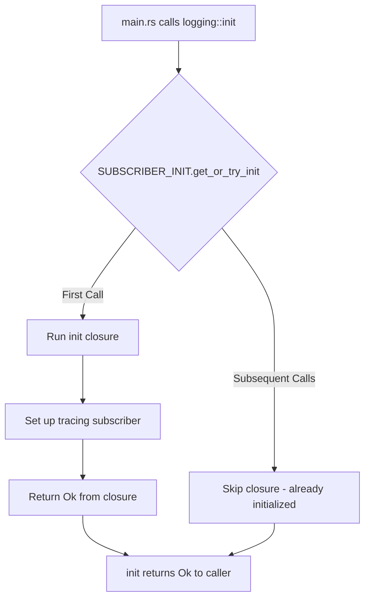

# C-001 Tracing Subscriber Panic Fix Plan

## Issue Summary
The TUI command panics with: `failed to set global default subscriber: SetGlobalDefaultError("a global default trace dispatcher has already been set")`

## Root Cause Analysis

### Problem in [`crates/cli/src/logging.rs`](many-lamps/crates/cli/src/logging.rs:19)
The `OnceLock` logic is inverted. The current code:
```rust
pub fn init(level: &str, json: bool) -> Result<()> {
    // Check if already initialized (only initialize once)
    if SUBSCRIBER_INITIALIZED.set(true).is_err() {
        // Already initialized, skip
        return Ok(());
    }
    // ... init code runs here even if set() returned Ok
}
```

The issue: `OnceLock::set()` returns `Ok(())` when it successfully sets the value (first call), and `Err(value)` when it's already set. The current code skips initialization when `set()` returns `Err` (already set), but runs init code on first call. However, the init code runs AFTER the set, so if tracing_subscriber's `.init()` is called twice (once from main.rs and once from dashboard), it will panic.

**The real issue**: The TUI command in `main.rs` calls `logging::init()` twice:
1. Line 175: `logging::init(&log_level, cli.json_logs)?;` - general init
2. Line 314: `logging::init("error", false)?;` - re-init for TUI with error level

Even with the `OnceLock` guard, if the first call completes successfully and then `.init()` is called, the second call will try to call `.init()` again on the same registry.

## Fix Strategy

### 1. Fix [`crates/cli/src/logging.rs`](many-lamps/crates/cli/src/logging.rs)

Change the initialization to use `get_or_try_init` pattern:

```rust
static SUBSCRIBER_INIT: OnceLock<()> = OnceLock::new();

pub fn init(level: &str, json: bool) -> Result<()> {
    SUBSCRIBER_INIT.get_or_try_init(|| {
        let filter = EnvFilter::try_from_default_env()
            .unwrap_or_else(|_| EnvFilter::new(level));

        if json {
            tracing_subscriber::registry()
                .with(filter)
                .with(fmt::layer().json().with_writer(std::io::stderr))
                .init();
        } else {
            tracing_subscriber::registry()
                .with(filter)
                .with(fmt::layer().with_target(true).with_thread_ids(true).with_writer(std::io::stderr))
                .init();
        }
        Ok(())
    })?;
    Ok(())
}
```

This ensures:
- `.init()` is called exactly once
- Subsequent calls return immediately without attempting to init again

### 2. Verify [`crates/cli/src/main.rs`](many-lamps/crates/cli/src/main.rs:311-315)

The Tui command re-initializes with "error" level:
```rust
Commands::Tui => {
    // Suppress INFO logs during TUI
    logging::init("error", false)?;
    tui::run(None).await?;
}
```

With the corrected `OnceLock` implementation, this will:
- First call (line 175): Sets up tracing with configured level
- Second call (line 314): Detects already initialized, returns Ok without calling `.init()` again

### 3. Verify [`crates/dashboard/src/lib.rs`](many-lamps/crates/dashboard/src/lib.rs)

The dashboard module should NOT call `logging::init()` directly. It should rely on the CLI to initialize logging. Check that no tracing init happens in dashboard.

## Implementation Steps

| Step | File | Action |
|------|------|--------|
| 1 | `crates/cli/src/logging.rs` | Refactor to use `get_or_try_init` with closure containing all init logic |
| 2 | `crates/cli/src/main.rs` | Verify Tui command doesn't need modification |
| 3 | `crates/dashboard/src/lib.rs` | Verify no duplicate tracing init |
| 4 | Test | Run `cargo run --bin mtrader tui` and verify no panic |

## Mermaid: Corrected Initialization Flow



## Testing Plan

1. **Unit Test**: Add test that calls `init()` multiple times and verifies no panic
2. **Integration Test**: Run TUI and verify it starts without panic
3. **Regression Test**: Run paper trading command to verify logging still works

## ML Module Architecture (Future Enhancement)

After fixing C-001, the ML modules are already structured for pluggability:

```
crates/ml/src/
├── lib.rs           # Main exports, TkanModel, FeatureVector
├── attention.rs     # CrossAssetAttention - pluggable attention
├── margin_softmax.rs # DirectionalSignal - pluggable classifier
├── uncertainty.rs   # UncertaintyEstimator - pluggable uncertainty
├── meta_learning.rs # MAML adapter - pluggable meta-learning
├── feature_pipeline.rs # FeatureExtractor - pluggable features
└── inference.rs     # InferenceEngine - pluggable inference
```

To add stock data support as a future enhancement:
1. Create `crates/data_sources/src/stock/csv.rs` for CSV ingestion
2. Create trait `DataSource` in `crates/ml/src/traits.rs`
3. Implement `StockDataSource` that converts CSV to `FeatureVector`
