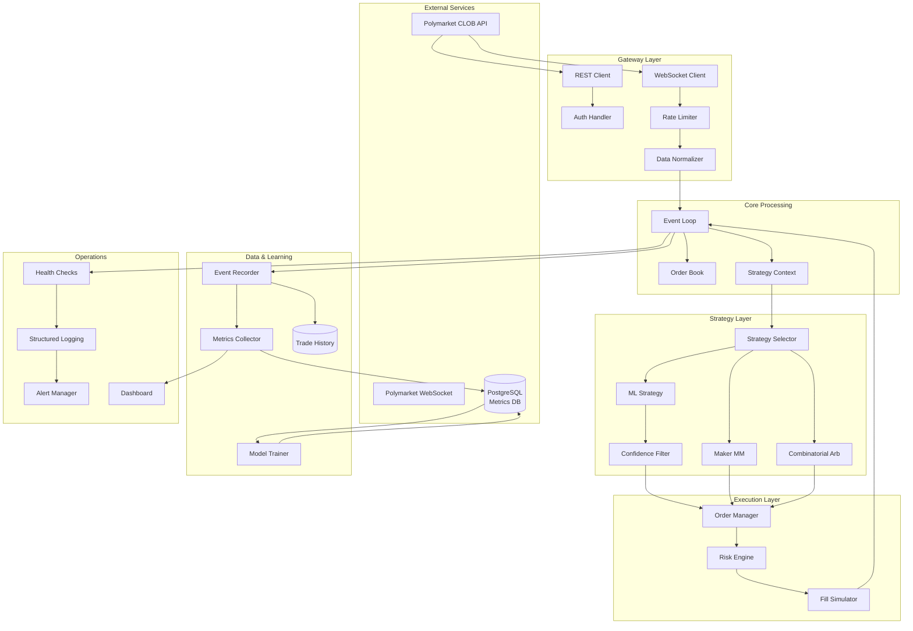
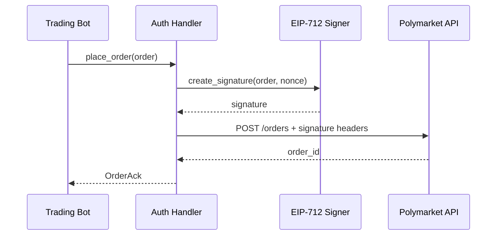
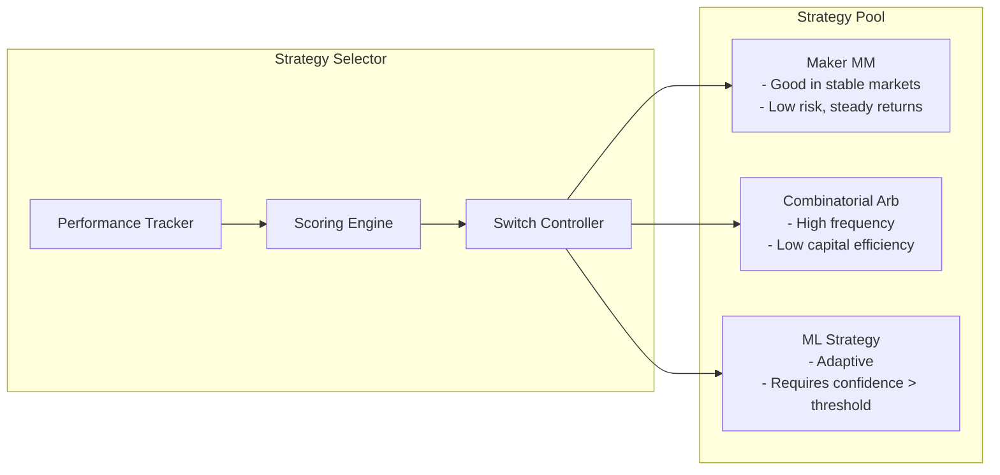
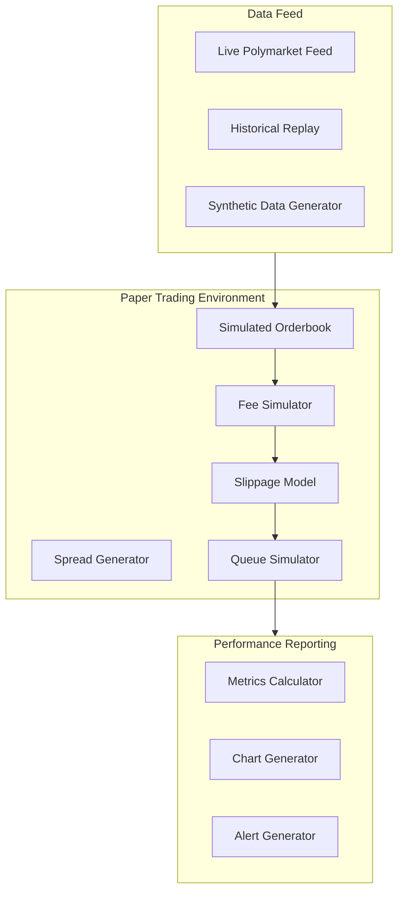
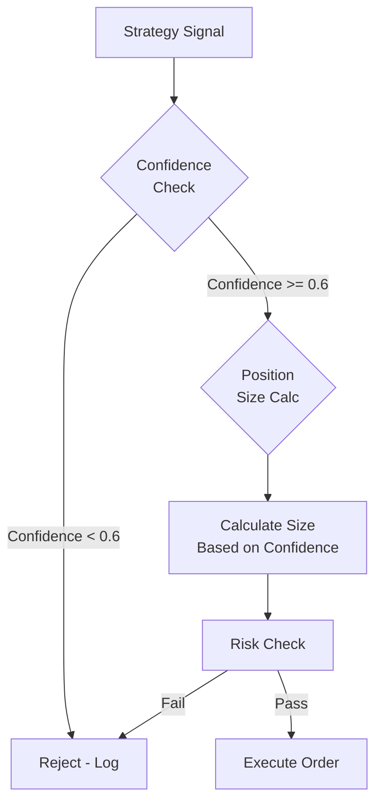

# Production Readiness Architecture for Trading Bot
## MTrader - Polymarket Trading Terminal

**Document Version:** 1.0  
**Date:** 2025-01-11  
**Status:** Design Specification (Implementation Pending)

---

## 1. Executive Summary

This document provides a comprehensive production readiness architecture for the MTrader trading bot, specifically designed for Polymarket prediction market trading. The architecture addresses critical gaps identified in the ML analysis and provides a robust foundation for production deployment.

### Key Design Goals
- **Reliability**: Graceful degradation, circuit breakers, health monitoring
- **Observability**: Metrics, logging, alerting, performance dashboards
- **Extensibility**: Plugin-based strategy selection, modular gateway architecture
- **Safety**: Multi-layer risk controls, confidence-based trade filtering
- **Learning**: Automated performance tracking and model improvement pipeline

---

## 2. System Architecture Overview

### 2.1 Component Architecture Diagram



### 2.2 Current State vs Target Architecture

| Layer | Current State | Target State |
|-------|--------------|--------------|
| Gateway | Basic WS/REST clients, no auth | Full EIP-712 signing, rate limiting, retry logic |
| Strategies | Single strategy selection | Multi-strategy with auto-switching |
| Paper Trading | Live-feed simulation | Full Polymarket-like simulation with replay |
| Risk | Basic limits | Multi-dimensional risk with circuit breakers |
| Data | Basic event recording | Full metrics DB with ML pipeline |
| Operations | CLI logging | Health checks, alerting, dashboard |

---

## 3. Polymarket Gateway Architecture

### 3.1 Gateway Module Structure

```
crates/gateway/src/
├── lib.rs                    # Module exports
├── ws_client.rs             # WebSocket client (existing)
├── rest_client.rs           # REST client (existing)
├── auth.rs                  # NEW: EIP-712 authentication
├── rate_limiter.rs          # NEW: Token bucket rate limiter
├── messages.rs              # Message types (existing)
├── parser.rs                # Parsing logic (existing)
├── error.rs                 # Error types (existing)
├── polymarket_client.rs     # NEW: Unified Polymarket client
└── normalizer.rs            # NEW: Data normalization layer
```

### 3.2 Authentication Architecture



#### Auth Handler Specification

```rust
// crates/gateway/src/auth.rs

/// EIP-712 signature domain
#[derive(Debug, Clone, Serialize, Deserialize)]
pub struct SignatureDomain {
    pub name: String,
    pub version: String,
    pub chain_id: u64,
    pub verifying_contract: Address,
}

/// Authenticated client configuration
#[derive(Debug, Clone)]
pub struct AuthConfig {
    pub api_key: String,
    pub api_secret: String,  // Private key for signing
    pub api_passphrase: String,
    pub domain: SignatureDomain,
}

/// Authentication errors
#[derive(Debug, thiserror::Error)]
pub enum AuthError {
    #[error("Signature creation failed: {0}")]
    SigningError(String),
    #[error("Invalid nonce: expected {expected}, got {actual}")]
    NonceMismatch { expected: u64, actual: u64 },
    #[error("API authentication failed: {0}")]
    ApiError(String),
    #[error("Rate limited - retry after {retry_after:?}")]
    RateLimited { retry_after: Duration },
}

/// Authentication handler for Polymarket CLOB
pub struct AuthHandler {
    config: AuthConfig,
    nonce: AtomicU64,
    last_nonce: u64,
}

impl AuthHandler {
    /// Create order payload with EIP-712 signature
    pub async fn sign_order(
        &self,
        order: &OrderPayload,
    ) -> Result<SignedOrder, AuthError> {
        let nonce = self.get_next_nonce().await?;
        
        let payload = OrderPayloadWithNonce {
            order,
            nonce: nonce.to_string(),
        };
        
        let domain = self.config.domain.clone();
        let message = Eip712Message::from_payload(&payload, &domain);
        let signature = self.sign_message(&message).await?;
        
        Ok(SignedOrder {
            payload,
            signature,
        })
    }
    
    /// Get next available nonce with synchronization
    async fn get_next_nonce(&self) -> Result<u64, AuthError> {
        // Fetch latest nonce from API if needed
        let latest = self.fetch_nonce().await?;
        
        let current = self.nonce.fetch_max(latest, Ordering::SeqCst);
        let next = current.max(latest) + 1;
        
        Ok(next)
    }
}
```

### 3.3 Rate Limiting Architecture

```rust
// crates/gateway/src/rate_limiter.rs

/// Token bucket rate limiter with burst support
pub struct TokenBucket {
    capacity: u64,
    tokens: AtomicU64,
    last_update: AtomicU64,
    refill_rate: u64,  // tokens per second
}

impl TokenBucket {
    /// Try to consume tokens, returns wait time if needed
    pub fn try_consume(&self, tokens: u64) -> Result<Duration, Duration> {
        let now = SystemTime::now()
            .duration_since(UNIX_EPOCH)
            .unwrap()
            .as_nanos() as u64;
        
        let last = self.last_update.load(Ordering::Relaxed);
        let elapsed = now.saturating_sub(last);
        
        // Calculate tokens to add
        let refill = (elapsed * self.refill_rate) / 1_000_000_000;
        
        let current = self.tokens.load(Ordering::Relaxed);
        let new_tokens = (current + refill).min(self.capacity);
        
        if new_tokens >= tokens {
            self.tokens.store(new_tokens - tokens, Ordering::Relaxed);
            self.last_update.store(now, Ordering::Relaxed);
            Ok(Duration::ZERO)
        } else {
            let needed = tokens - new_tokens;
            let wait = (needed * 1_000_000_000) / self.refill_rate;
            Err(Duration::from_nanos(wait))
        }
    }
}

/// Rate limiter manager for multiple endpoints
pub struct RateLimiterManager {
    order_rate: TokenBucket,
    general_rate: TokenBucket,
    total_rate: TokenBucket,
}

impl RateLimiterManager {
    /// Check if order submission is allowed
    pub async fn check_order_rate(&self) -> Result<(), Duration> {
        self.order_rate.try_consume(1)?;
        self.total_rate.try_consume(1)?;
        Ok(())
    }
    
    /// Check if general API call is allowed
    pub async fn check_general_rate(&self) -> Result<(), Duration> {
        self.general_rate.try_consume(1)?;
        self.total_rate.try_consume(1)?;
        Ok(())
    }
}
```

### 3.4 Data Normalization Layer

```rust
// crates/gateway/src/normalizer.rs

/// Normalized market data from Polymarket
#[derive(Debug, Clone)]
pub struct NormalizedMarketData {
    pub market_id: MarketId,
    pub token_id: TokenId,
    pub timestamp_ns: u64,
    pub best_bid: Option<Tick>,
    pub best_bid_size: Size,
    pub best_ask: Option<Tick>,
    pub best_ask_size: Size,
    pub mid_price: Option<Tick>,
    pub spread_bps: Option<u16>,
    pub last_price: Option<Tick>,
    pub last_size: Option<Size>,
    pub volume_24h: u64,
}

/// Polymarket-specific normalizer
pub struct PolymarketNormalizer {
    tick_size_bps: u16,
    price_multiplier: f64,
}

impl PolymarketNormalizer {
    /// Normalize Polymarket book snapshot to internal format
    pub fn normalize_book_snapshot(
        &self,
        raw: &PolyBookSnapshot,
    ) -> NormalizedMarketData {
        let bids: Vec<(Tick, Size)> = raw.bids
            .iter()
            .filter_map(|level| {
                let price = self.normalize_price(level.price.clone())?;
                let size = self.normalize_size(level.size.clone())?;
                Some((price, size))
            })
            .collect();
        
        let asks: Vec<(Tick, Size)> = raw.asks
            .iter()
            .filter_map(|level| {
                let price = self.normalize_price(level.price.clone())?;
                let size = self.normalize_size(level.size.clone())?;
                Some((price, size))
            })
            .collect();
        
        let (best_bid, best_bid_size) = bids.first()
            .cloned()
            .unwrap_or((None, 0));
        let (best_ask, best_ask_size) = asks.first()
            .cloned()
            .unwrap_or((None, 0));
        
        let (mid_price, spread_bps) = match (best_bid, best_ask) {
            (Some(bid), Some(ask)) => {
                let mid = (bid + ask) / 2;
                let spread = ask - bid;
                (Some(mid), Some(spread))
            }
            _ => (None, None),
        };
        
        NormalizedMarketData {
            market_id: raw.condition_id.clone().into(),
            token_id: raw.token_id.clone(),
            timestamp_ns: raw.timestamp_ms * 1_000_000,
            best_bid,
            best_bid_size,
            best_ask,
            best_ask_size,
            mid_price,
            spread_bps,
            last_price: raw.last_price.map(|p| self.normalize_price(p).unwrap_or(0)),
            last_size: raw.last_size.map(|s| self.normalize_size(s).unwrap_or(0)),
            volume_24h: raw.volume_24h.map(|v| v as u64).unwrap_or(0),
        }
    }
    
    fn normalize_price(&self, price: String) -> Option<Tick> {
        // Polymarket prices are in "0.5" format, convert to ticks
        let parsed: f64 = price.parse().ok()?;
        let tick = (parsed * 10000.0 / (self.tick_size_bps as f64 / 100.0)) as u16;
        Some(tick.min(u16::MAX))
    }
    
    fn normalize_size(&self, size: String) -> Option<Size> {
        // Sizes in "100.00" format, convert to micro-shares
        let parsed: f64 = size.parse().ok()?;
        let micro = (parsed * 1_000_000.0) as u64;
        Some(micro)
    }
}
```

---

## 4. Strategy Selection Framework

### 4.1 Multi-Strategy Architecture



### 4.2 Performance Tracking

```rust
// crates/strategy/src/selector/performance_tracker.rs

/// Performance metrics for a strategy
#[derive(Debug, Clone, Serialize, Deserialize)]
pub struct StrategyPerformance {
    pub strategy_id: StrategyId,
    pub period_start: SystemTime,
    pub period_end: SystemTime,
    pub trade_count: u64,
    pub win_count: u64,
    pub loss_count: u64,
    pub win_rate: f64,
    pub total_pnl: i64,              // micro-USDC
    pub total_fees: u64,             // micro-USDC
    pub net_pnl: i64,                // micro-USDC
    pub sharpe_ratio: f64,
    pub max_drawdown: f64,           // percentage
    pub avg_trade_pnl: f64,
    pub pnl_std_dev: f64,
    pub avg_position_duration_ms: u64,
    pub confidence_avg: f64,
    pub market_conditions: MarketConditionSummary,
}

/// Market condition during trading
#[derive(Debug, Clone, Serialize, Deserialize)]
pub enum MarketCondition {
    TrendingUp,
    TrendingDown,
    RangeBound,
    HighVolatility,
    LowVolatility,
    Uncertain,
}

/// Performance tracker with automatic metric collection
pub struct PerformanceTracker {
    trades: RwLock<Vec<TradeRecord>>,
    current_period: AtomicU64,
    config: TrackerConfig,
}

impl PerformanceTracker {
    /// Record a completed trade
    pub fn record_trade(&self, trade: TradeRecord) {
        let mut trades = self.trades.write().unwrap();
        trades.push(trade);
        
        // Periodically flush to database
        if trades.len() >= self.config.flush_threshold {
            self.flush().unwrap_or_else(|e| {
                tracing::error!("Failed to flush trades: {:?}", e);
            });
        }
    }
    
    /// Calculate performance metrics for a period
    pub fn calculate_metrics(&self, since: SystemTime) -> StrategyPerformance {
        let trades = self.traces.read().unwrap();
        let period_trades: Vec<_> = trades
            .iter()
            .filter(|t| t.timestamp >= since)
            .collect();
        
        let pnl_values: Vec<f64> = period_trades
            .iter()
            .map(|t| t.pnl_micro_usdc as f64 / 1_000_000.0)
            .collect();
        
        let wins = pnl_values.iter().filter(|&&p| p > 0.0).count();
        let losses = pnl_values.iter().filter(|&&p| p <= 0.0).count();
        
        let total_pnl: f64 = pnl_values.iter().sum();
        let avg_pnl = if !pnl_values.is_empty() {
            total_pnl / pnl_values.len() as f64
        } else {
            0.0
        };
        
        let variance = pnl_values.iter()
            .map(|p| (p - avg_pnl).powi(2))
            .sum::<f64>() / pnl_values.len().max(1) as f64;
        let std_dev = variance.sqrt();
        
        // Sharpe ratio (assuming 0% risk-free rate)
        let sharpe = if std_dev > 0.0 {
            (avg_pnl * 252.0 / std_dev).sqrt()  // Annualized
        } else {
            0.0
        };
        
        StrategyPerformance {
            strategy_id: self.strategy_id.clone(),
            period_start: since,
            period_end: SystemTime::now(),
            trade_count: period_trades.len() as u64,
            win_count: wins as u64,
            loss_count: losses as u64,
            win_rate: if !period_trades.is_empty() {
                wins as f64 / period_trades.len() as f64
            } else {
                0.0
            },
            total_pnl: (total_pnl * 1_000_000.0) as i64,
            net_pnl: (total_pnl * 1_000_000.0) as i64,  // Simplified
            sharpe_ratio: sharpe,
            avg_trade_pnl: avg_pnl,
            pnl_std_dev: std_dev,
            ..Default::default()
        }
    }
}
```

### 4.3 Strategy Scoring Engine

```rust
// crates/strategy/src/selector/scoring_engine.rs

/// Scoring configuration
#[derive(Debug, Clone)]
pub struct ScoringConfig {
    pub pnl_weight: f64,              // 0.4
    pub win_rate_weight: f64,         // 0.2
    pub sharpe_weight: f64,           // 0.2
    pub drawdown_weight: f64,         // 0.1
    pub confidence_weight: f64,       // 0.1
    pub min_trades_for_scoring: u32,
    pub lookback_period_hours: u32,
}

/// Composite strategy score
#[derive(Debug, Clone)]
pub struct StrategyScore {
    pub strategy_id: StrategyId,
    pub total_score: f64,
    pub component_scores: ComponentScores,
    pub confidence: f64,              // How confident we are in this score
    pub last_updated: SystemTime,
}

#[derive(Debug, Clone)]
pub struct ComponentScores {
    pub pnl_score: f64,
    pub win_rate_score: f64,
    pub sharpe_score: f64,
    pub drawdown_score: f64,
    pub confidence_score: f64,
}

/// Strategy scoring engine
pub struct ScoringEngine {
    config: ScoringConfig,
    historical_scores: DashMap<StrategyId, Vec<(SystemTime, StrategyScore)>>,
}

impl ScoringEngine {
    /// Calculate overall score for a strategy
    pub fn calculate_score(
        &self,
        strategy_id: &StrategyId,
        performance: &StrategyPerformance,
        current_confidence: f64,
    ) -> StrategyScore {
        // Normalize components to 0-1 scale
        let pnl_score = self.normalize_pnl_score(performance.total_pnl);
        let win_rate_score = performance.win_rate;
        let sharpe_score = self.normalize_sharpe(performance.sharpe_ratio);
        let drawdown_score = 1.0 - (performance.max_drawdown / self.config.max_acceptable_drawdown);
        let confidence_score = current_confidence;
        
        let total_score = 
            self.config.pnl_weight * pnl_score +
            self.config.win_rate_weight * win_rate_score +
            self.config.sharpe_weight * sharpe_score +
            self.config.drawdown_weight * drawdown_score.max(0.0) +
            self.config.confidence_weight * confidence_score;
        
        StrategyScore {
            strategy_id: strategy_id.clone(),
            total_score,
            component_scores: ComponentScores {
                pnl_score,
                win_rate_score,
                sharpe_score,
                drawdown_score: drawdown_score.max(0.0),
                confidence_score,
            },
            confidence: self.calculate_confidence(performance),
            last_updated: SystemTime::now(),
        }
    }
    
    /// Get ranked strategies for current market conditions
    pub fn get_ranked_strategies(
        &self,
        market_condition: &MarketCondition,
        min_score: f64,
    ) -> Vec<(StrategyId, StrategyScore)> {
        let mut scores: Vec<_> = self.historical_scores
            .iter()
            .filter(|(_, history)| {
                history.last().map(|(_, s)| s.confidence > 0.5).unwrap_or(false)
            })
            .map(|(id, history)| {
                let latest = history.last().unwrap().1.clone();
                (id.clone(), latest)
            })
            .filter(|(_, s)| s.total_score >= min_score)
            .collect();
        
        // Sort by total score descending
        scores.sort_by(|a, b| b.1.total_score.partial_cmp(&a.1.total_score).unwrap());
        
        scores
    }
    
    fn normalize_pnl_score(&self, pnl: i64) -> f64 {
        // Map to 0-1 scale based on historical PnL distribution
        let normalized = (pnl as f64 / self.config.pnl_normalization_factor)
            .clamp(-1.0, 1.0);
        (normalized + 1.0) / 2.0
    }
    
    fn normalize_sharpe(&self, sharpe: f64) -> f64 {
        // Cap at 4.0 for normalization (Sharpe > 4 is excellent)
        (sharpe / 4.0).clamp(0.0, 1.0)
    }
    
    fn calculate_confidence(&self, performance: &StrategyPerformance) -> f64 {
        // Higher trade count = more confidence
        let trade_confidence = (performance.trade_count as f64 / 100.0).min(1.0);
        
        // More recent data = more confidence
        let age_hours = performance.period_end
            .duration_since(performance.period_start)
            .map(|d| d.as_secs() / 3600).unwrap_or(0) as f64;
        let recency_confidence = (1.0 / (1.0 + age_hours / 24.0)).min(1.0);
        
        trade_confidence * 0.7 + recency_confidence * 0.3
    }
}
```

### 4.4 Automatic Strategy Switching

```rust
// crates/strategy/src/selector/mod.rs

/// Strategy switching configuration
#[derive(Debug, Clone)]
pub struct SwitchConfig {
    pub min_score_improvement: f64,    // 0.1 = 10% better before switching
    pub switch_cooldown_ms: u64,       // 300000 = 5 minutes
    pub max_switches_per_hour: u32,
    pub enable_auto_switch: bool,
    pub preferred_strategy: Option<StrategyId>,
}

/// Strategy switch controller
pub struct StrategySwitchController {
    config: SwitchConfig,
    scores: ScoringEngine,
    tracker: PerformanceTracker,
    last_switch: AtomicU64,
    switch_count_hour: AtomicU32,
    current_strategy: AtomicStr,
}

impl StrategySwitchController {
    /// Evaluate if strategy switch is needed
    pub fn evaluate_switch(&self) -> Option<SwitchDecision> {
        if !self.config.enable_auto_switch {
            return None;
        }
        
        let current_id = self.current_strategy.load();
        let current_score = self.scores.get_score(&current_id);
        
        // Get alternative strategies
        let alternatives = self.scores.get_ranked_strategies(
            &self.detect_market_condition(),
            0.0,
        );
        
        if let Some((best_id, best_score)) = alternatives.first() {
            let improvement = best_score.total_score - current_score.total_score;
            
            if improvement > self.config.min_score_improvement
                && self.can_switch()
            {
                return Some(SwitchDecision {
                    from: current_id,
                    to: best_id.clone(),
                    reason: format!(
                        "Score improved by {:.1}%: {:.3} -> {:.3}",
                        improvement * 100.0,
                        current_score.total_score,
                        best_score.total_score
                    ),
                    timestamp: SystemTime::now(),
                });
            }
        }
        
        None
    }
    
    fn can_switch(&self) -> bool {
        let now = SystemTime::now()
            .duration_since(UNIX_EPOCH)
            .unwrap()
            .as_millis() as u64;
        
        // Check cooldown
        let last_switch = self.last_switch.load(Ordering::Relaxed);
        if now - last_switch < self.config.switch_cooldown_ms {
            return false;
        }
        
        // Check rate limit
        if self.switch_count_hour.load(Ordering::Relaxed) 
            >= self.config.max_switches_per_hour 
        {
            return false;
        }
        
        true
    }
    
    fn detect_market_condition(&self) -> MarketCondition {
        // Use recent price action and volatility to determine condition
        MarketCondition::Uncertain  // Placeholder
    }
}

/// Decision to switch strategies
#[derive(Debug, Clone)]
pub struct SwitchDecision {
    pub from: StrategyId,
    pub to: StrategyId,
    pub reason: String,
    pub timestamp: SystemTime,
}
```

---

## 5. Paper Trading Enhancement

### 5.1 Enhanced Paper Trading Architecture



### 5.2 Simulated Orderbook

```rust
// crates/sim/src/simulated_book.rs

/// Configuration for simulated orderbook
#[derive(Debug, Clone)]
pub struct SimulatedBookConfig {
    pub base_spread_bps: u16,           // 20 = 0.2%
    pub spread_volatility: f64,         // 0.1 = 10% variation
    pub min_liquidity: u64,             // 10_000_000 = 10 shares
    pub queue_imbalance_factor: f64,    // 0.5
    pub tick_size_bps: u16,
}

/// Simulated orderbook that mimics Polymarket behavior
pub struct SimulatedBook {
    config: SimulatedBookConfig,
    bids: BTreeMap<Tick, Level>,
    asks: BTreeMap<Tick, Level>,
    last_mid_price: Option<Tick>,
    volatility_state: f64,
}

struct Level {
    total_size: Size,
    orders: Vec<SimulatedOrder>,
    queue_position: HashMap<ClientOrderId, u64>,
}

impl SimulatedBook {
    /// Process a new order in simulation
    pub fn process_order(
        &mut self,
        order: &SimulatedOrder,
        timestamp_ns: u64,
    ) -> SimResult<Vec<SimulatedFill>> {
        match order.side {
            Side::Buy => self.process_bid_order(order, timestamp_ns),
            Side::Sell => self.process_ask_order(order, timestamp_ns),
        }
    }
    
    fn process_bid_order(
        &mut self,
        order: &SimulatedOrder,
        timestamp_ns: u64,
    ) -> SimResult<Vec<SimulatedFill>> {
        let mut fills = Vec::new();
        
        // Check against asks
        let mut remaining_size = order.size;
        
        for (ask_tick, level) in self.asks.iter_mut() {
            if ask_tick > &order.price_tick {
                break;  // Order doesn't reach this level
            }
            
            while remaining_size > 0 && level.total_size > 0 {
                // Calculate fill price with slippage
                let fill_tick = self.calculate_slippage(
                    *ask_tick,
                    remaining_size,
                    Side::Sell,
                );
                
                // Calculate queue position
                let queue_ahead = level.queue_position
                    .values()
                    .sum::<u64>();
                
                // Simulate queue wait time
                let queue_delay = self.calculate_queue_delay(queue_ahead);
                
                let fill = SimulatedFill {
                    order_id: order.order_id.clone(),
                    client_order_id: order.client_order_id.clone(),
                    price_tick: fill_tick,
                    size: remaining_size.min(level.total_size),
                    is_maker: false,  // Taker order
                    fee_amount: self.calculate_fee(fill_tick, remaining_size),
                    timestamp_ns: timestamp_ns + queue_delay,
                };
                
                fills.push(fill);
                remaining_size -= fill.size;
                level.total_size -= fill.size;
                
                // Remove filled orders
                level.orders.retain(|o| o.remaining_size > 0);
                
                if remaining_size == 0 {
                    break;
                }
            }
        }
        
        // Add remaining as maker order if not fully filled
        if remaining_size > 0 {
            self.add_maker_order(order, remaining_size, timestamp_ns);
        }
        
        Ok(fills)
    }
    
    fn calculate_slippage(
        &self,
        base_tick: Tick,
        size: Size,
        side: Side,
    ) -> Tick {
        // Slippage increases with size
        let size_factor = (size as f64 / 1_000_000.0).min(1.0);
        let volatility = self.volatility_state;
        
        let slippage_bps = base_tick as f64 * 0.0001 
            * size_factor 
            * volatility 
            * self.config.queue_imbalance_factor;
        
        match side {
            Side::Buy => (base_tick as f64 + slippage_bps) as Tick,
            Side::Sell => (base_tick as f64 - slippage_bps) as Tick,
        }
    }
    
    fn calculate_queue_delay(&self, queue_ahead: u64) -> u64 {
        // Simulate latency based on queue position
        // More queue = more delay
        (queue_ahead / 1_000_000) * 10_000_000  // 10ms per share in queue
    }
    
    /// Generate a realistic spread
    pub fn generate_spread(&mut self) -> (Tick, Tick) {
        // Random walk for mid price
        let mid_price_change = (fastrand::i32(-5..5) as f64) 
            * self.volatility_state 
            * 10.0;
        
        let new_mid = self.last_mid_price
            .map(|p| (p as f64 + mid_price_change) as Tick)
            .unwrap_or(5000);
        
        // Spread varies around base spread
        let spread_variation = fastrand::f64() * self.config.spread_volatility;
        let spread_bps = (self.config.base_spread_bps as f64 * (1.0 + spread_variation)) as Tick;
        
        let bid = new_mid - spread_bps / 2;
        let ask = new_mid + spread_bps / 2;
        
        self.last_mid_price = Some(new_mid);
        
        (bid.max(1), ask)
    }
}
```

### 5.3 Fee Simulation

```rust
// crates/sim/src/fee_simulator.rs

/// Polymarket fee structure simulation
#[derive(Debug, Clone)]
pub struct PolymarketFees {
    pub maker_fee_bps: i16,     // -10 = rebate
    pub taker_fee_bps: u16,     // 100 = 1%
    pub gas_rebate_bps: u16,
    pub volume_discount_tiers: Vec<VolumeTier>,
}

struct VolumeTier {
    min_volume_30d: u64,
    discount_bps: u16,
}

/// Fee calculator for paper trading
pub struct FeeCalculator {
    fees: PolymarketFees,
    user_volume_30d: u64,
}

impl FeeCalculator {
    /// Calculate fee for a fill
    pub fn calculate_fee(
        &self,
        price_tick: Tick,
        size: Size,
        is_maker: bool,
    ) -> u64 {
        let notional = (price_tick as u64 * size) / 1_000_000;
        
        // Base fee rate
        let base_rate = if is_maker {
            self.fees.maker_fee_bps
        } else {
            self.fees.taker_fee_bps as i16
        };
        
        // Volume discount
        let volume_discount = self.get_volume_discount();
        
        // Gas rebate for makers
        let gas_rebate = if is_maker {
            self.fees.gas_rebate_bps
        } else {
            0
        };
        
        let effective_rate = base_rate + volume_discount as i16 + gas_rebate as i16;
        
        // Calculate fee
        let fee = (notional as i64 * effective_rate as i64) / 10000;
        
        fee as u64
    }
    
    fn get_volume_discount(&self) -> u16 {
        for tier in self.fees.volume_discount_tiers.iter().rev() {
            if self.user_volume_30d >= tier.min_volume_30d {
                return tier.discount_bps;
            }
        }
        0
    }
}
```

---

## 6. Auto-Trading System

### 6.1 Confidence-Based Trade Filtering



### 6.2 Confidence Filter Implementation

```rust
// crates/strategy/src/confidence_filter.rs

/// Confidence-based trade filter configuration
#[derive(Debug, Clone)]
pub struct ConfidenceFilterConfig {
    pub min_confidence: f64,                 // 0.6
    pub max_position_confidence_scaling: f64, // 2.0
    pub min_edge_ticks: u16,                 // 1
    pub require_edge_confirmation: bool,
    pub allow_neutral_signal: bool,
}

/// Confidence-weighted position sizing
#[derive(Debug, Clone)]
pub struct PositionSizing {
    pub base_size: Size,
    pub confidence_multiplier: f64,
    pub final_size: Size,
    pub edge_ticks: i16,
}

/// Confidence filter for auto-trading
pub struct ConfidenceFilter {
    config: ConfidenceFilterConfig,
    ml_strategy: Option<Box<dyn MlSignalProvider>>,
}

impl ConfidenceFilter {
    /// Filter and size an order based on confidence
    pub fn filter_order(
        &self,
        signal: &TradingSignal,
        current_position: i64,
        market_data: &MarketSnapshot,
    ) -> Result<FilteredOrder, FilterReason> {
        // Check minimum confidence
        if signal.confidence < self.config.min_confidence {
            return Err(FilterReason::LowConfidence {
                signal_confidence: signal.confidence,
                required: self.config.min_confidence,
            });
        }
        
        // Calculate edge
        let edge = self.calculate_edge(&signal, market_data);
        
        // Check minimum edge
        if edge.abs() < self.config.min_edge_ticks as i16 {
            return Err(FilterReason::InsufficientEdge {
                edge_ticks: edge,
                required: self.config.min_edge_ticks,
            });
        }
        
        // Calculate position size based on confidence
        let sizing = self.calculate_position_size(
            &signal,
            current_position,
            signal.confidence,
        );
        
        Ok(FilteredOrder {
            signal: signal.clone(),
            size: sizing.final_size,
            edge_ticks: edge,
            confidence: signal.confidence,
        })
    }
    
    fn calculate_edge(
        &self,
        signal: &TradingSignal,
        market: &MarketSnapshot,
    ) -> i16 {
        match (signal.direction, market.best_bid, market.best_ask) {
            (SignalDirection::Buy, Some(best_bid), _) => {
                let reference = signal.reference_price
                    .unwrap_or(best_bid);
                (reference as i16) - (best_bid as i16)
            }
            (SignalDirection::Sell, _, Some(best_ask)) => {
                let reference = signal.reference_price
                    .unwrap_or(best_ask);
                (best_ask as i16) - (reference as i16)
            }
            _ => 0,
        }
    }
    
    fn calculate_position_size(
        &self,
        signal: &TradingSignal,
        current_position: i64,
        confidence: f64,
    ) -> PositionSizing {
        let base_size = signal.suggested_size;
        
        // Scale size by confidence (higher confidence = larger position)
        let multiplier = 1.0 + (confidence - self.config.min_confidence) 
            * self.config.max_position_confidence_scaling;
        
        let adjusted_size = (base_size as f64 * multiplier) as Size;
        
        // Consider current position (don't overtrade)
        let position_impact = match signal.direction {
            SignalDirection::Buy => adjusted_size.saturating_sub(
                current_position.max(0) as u64
            ),
            SignalDirection::Sell => adjusted_size.saturating_add(
                (-current_position).max(0) as u64
            ),
        };
        
        PositionSizing {
            base_size,
            confidence_multiplier: multiplier,
            final_size: position_impact,
            edge_ticks: 0,  // Calculated separately
        }
    }
}

/// Result of confidence filtering
#[derive(Debug, Clone)]
pub struct FilteredOrder {
    pub signal: TradingSignal,
    pub size: Size,
    pub edge_ticks: i16,
    pub confidence: f64,
}

/// Reason for order rejection
#[derive(Debug, Clone)]
pub enum FilterReason {
    LowConfidence {
        signal_confidence: f64,
        required: f64,
    },
    InsufficientEdge {
        edge_ticks: i16,
        required: u16,
    },
    PositionLimitExceeded,
    DailyLossLimitReached,
    CircuitBreakerActive,
}
```

### 6.3 Circuit Breaker Integration

```rust
// crates/risk/src/circuit_breaker.rs

/// Circuit breaker configuration
#[derive(Debug, Clone)]
pub struct ProductionCircuitBreakerConfig {
    pub max_consecutive_losses: u32,         // 5
    pub max_drawdown_pct: f64,               // 0.10 = 10%
    pub max_daily_loss_micro: i64,           // 100_000_000 = $100
    pub max_position_size: Size,             // 500_000_000 = 500 shares
    pub max_order_rate_per_min: u32,         // 60
    pub latency_threshold_ms: u64,           // 5000
    pub error_rate_threshold: f64,           // 0.1 = 10% errors
    pub recovery_check_interval_ms: u64,     // 60000 = 1 minute
}

/// Circuit breaker state
#[derive(Debug, Clone, Copy, PartialEq)]
pub enum CircuitState {
    Normal,
    Warning,
    Halted,
    Recovering,
}

/// Production circuit breaker with all safeguards
pub struct ProductionCircuitBreaker {
    config: ProductionCircuitBreakerConfig,
    state: AtomicU8,  // CircuitState as u8
    
    // Metrics
    consecutive_losses: AtomicU32,
    daily_pnl: AtomicI64,
    peak_equity: AtomicI64,
    current_equity: AtomicI64,
    order_count_minute: AtomicU32,
    last_order_time: AtomicU64,
    error_count: AtomicU64,
    total_requests: AtomicU64,
    
    // Timestamps
    last_halt_time: AtomicU64,
    last_error_time: AtomicU64,
}

impl CircuitBreaker for ProductionCircuitBreaker {
    fn check(&self) -> Result<(), CircuitBreakerError> {
        let state = self.state.load(Ordering::Relaxed);
        
        match state {
            CircuitState::Halted => {
                // Check if we should try recovering
                if self.should_try_recovery() {
                    self.state.store(CircuitState::Recovering as u8);
                    Ok(())
                } else {
                    Err(CircuitBreakerError::Halted)
                }
            }
            CircuitState::Recovering => {
                if self.recovery_check_passed() {
                    self.state.store(CircuitState::Normal as u8);
                    Ok(())
                } else {
                    Err(CircuitBreakerError::RecoveryInProgress)
                }
            }
            _ => {
                // Check all conditions
                self.check_drawdown()?;
                self.check_daily_loss()?;
                self.check_position_limits()?;
                self.check_order_rate()?;
                self.check_error_rate()?;
                
                // Update equity
                self.update_equity();
                
                Ok(())
            }
        }
    }
}

impl ProductionCircuitBreaker {
    fn check_drawdown(&self) -> Result<(), CircuitBreakerError> {
        let peak = self.peak_equity.load(Ordering::Relaxed);
        let current = self.current_equity.load(Ordering::Relaxed);
        
        if peak > 0 {
            let drawdown = (peak - current) as f64 / peak as f64;
            
            if drawdown >= self.config.max_drawdown_pct {
                self.halt_with_reason(CircuitBreakerError::MaxDrawdownExceeded);
                return Err(CircuitBreakerError::MaxDrawdownExceeded);
            } else if drawdown >= self.config.max_drawdown_pct * 0.7 {
                self.state.store(CircuitState::Warning as u8);
            }
        }
        
        Ok(())
    }
    
    fn halt_with_reason(&self, reason: CircuitBreakerError) {
        self.state.store(CircuitState::Halted as u8);
        
        let now = SystemTime::now()
            .duration_since(UNIX_EPOCH)
            .unwrap()
            .as_millis() as u64;
        
        self.last_halt_time.store(now, Ordering::Relaxed);
        
        tracing::error!(
            reason = ?reason,
            consecutive_losses = self.consecutive_losses.load(Ordering::Relaxed),
            daily_pnl = self.daily_pnl.load(Ordering::Relaxed),
            "Circuit breaker halted"
        );
    }
}
```

---

## 7. Data Pipeline for Strategy Learning

### 7.1 Data Pipeline Architecture

```mermaid
flowchart LR
    subgraph Collection["Data Collection"]
        TRADES["Trade Events"]
        ORDERS["Order Events"]
        MARKET["Market Data"]
        SIGNALS["Strategy Signals"]
    end
    
    subgraph Storage["Data Storage"]
        PARQUET["Parquet Files"]
        POSTGRES["PostgreSQL\nMetrics DB"]
        CACHE["Redis\nHot Cache"]
    end
    
    subgraph Processing["Processing Pipeline"]
        TRANSFORM["Transform"]
        AGGREGATE["Aggregate"]
        FEATURE["Feature Engineering"]
        TRAIN["Model Training"]
        VALIDATE["Validation"]
    end
    
    subgraph Output["Model Output"]
        MODELS["Trained Models"]
        METRICS["Performance Metrics"]
        ALERTS["Alerts"]
    end
    
    Collection --> Storage
    Storage --> Processing
    Processing --> Output
    Output --> Collection
```



### 7.2 Trade Outcome Tracking

```rust
// crates/data_pipeline/src/outcome_tracker.rs

/// Trade outcome with full context for ML training
#[derive(Debug, Clone, Serialize, Deserialize)]
pub struct TradeOutcome {
    // Signal context
    pub signal_id: String,
    pub strategy_id: StrategyId,
    pub signal_timestamp_ns: u64,
    pub signal_confidence: f64,
    pub signal_direction: SignalDirection,
    pub signal_features: Vec<f64>,
    
    // Execution context
    pub order_id: String,
    pub execution_timestamp_ns: u64,
    pub fill_price_tick: Tick,
    pub fill_size: Size,
    pub is_maker: bool,
    pub fee_amount: u64,
    
    // Outcome context
    pub outcome_timestamp_ns: u64,
    pub exit_price_tick: Option<Tick>,
    pub exit_timestamp_ns: Option<u64>,
    pub pnl_micro_usdc: i64,
    pub pnl_bps: f64,
    pub holding_period_ms: u64,
    pub is_win: bool,
    
    // Market context
    pub entry_market_condition: MarketCondition,
    pub volatility_at_entry: f64,
    pub spread_at_entry: u16,
}

/// Outcome tracker for ML training data
pub struct OutcomeTracker {
    pending_outcomes: RwLock<HashMap<String, TradeOutcome>>,
    completed_outcomes: RwLock<Vec<TradeOutcome>>,
    config: TrackerConfig,
}

impl OutcomeTracker {
    /// Register a new trade for outcome tracking
    pub fn register_trade(&self, outcome: TradeOutcome) {
        let mut pending = self.pending_outcomes.write().unwrap();
        pending.insert(outcome.order_id.clone(), outcome);
    }
    
    /// Record trade completion and update features
    pub fn record_completion(
        &self,
        order_id: &str,
        exit_price: Tick,
        exit_timestamp_ns: u64,
    ) {
        let mut pending = self.pending_outcomes.write().unwrap();
        
        if let Some(mut outcome) = pending.remove(order_id) {
            outcome.exit_price_tick = Some(exit_price);
            outcome.outcome_timestamp_ns = exit_timestamp_ns;
            
            // Calculate PnL
            let entry_value = outcome.fill_price_tick as i64 
                * outcome.fill_size as i64;
            let exit_value = exit_price as i64 
                * outcome.fill_size as i64;
            
            let fee_total = outcome.fee_amount as i64 * 2;  // Entry + exit
            outcome.pnl_micro_usdc = (exit_value - entry_value) - fee_total;
            
            // Calculate PnL in basis points
            if entry_value > 0 {
                outcome.pnl_bps = (outcome.pnl_micro_usdc as f64 / entry_value as f64) 
                    * 10000.0;
            }
            
            // Calculate holding period
            outcome.holding_period_ms = (exit_timestamp_ns 
                - outcome.execution_timestamp_ns) / 1_000_000;
            
            outcome.is_win = outcome.pnl_micro_usdc > 0;
            
            // Move to completed
            let mut completed = self.completed_outcomes.write().unwrap();
            completed.push(outcome);
            
            // Periodically persist to database
            if completed.len() % 100 == 0 {
                self.persist_outcomes();
            }
        }
    }
    
    /// Get training data for model
    pub fn get_training_data(
        &self,
        since: SystemTime,
        min_samples: usize,
    ) -> TrainingData {
        let completed = self.completed_outcomes.read().unwrap();
        
        let filtered: Vec<_> = completed
            .iter()
            .filter(|o| o.outcome_timestamp_ns > since)
            .filter(|o| o.is_win || o.is_win)  // All completed trades
            .cloned()
            .collect();
        
        if filtered.len() < min_samples {
            return TrainingData::InsufficientData {
                available: filtered.len(),
                required: min_samples,
            };
        }
        
        TrainingData::Ready(TrainingDataset {
            samples: filtered,
            features: self.extract_features(&filtered),
            labels: filtered.iter().map(|o| o.is_win as u8).collect(),
            metadata: TrainingMetadata {
                total_samples: filtered.len(),
                win_rate: filtered.iter().filter(|o| o.is_win).count() 
                    as f64 / filtered.len() as f64,
                avg_pnl_bps: filtered.iter()
                    .map(|o| o.pnl_bps).sum::<f64>() / filtered.len() as f64,
            },
        })
    }
}
```

### 7.3 Database Schema

```sql
-- PostgreSQL Schema for Production Trading Bot

-- Strategy performance metrics
CREATE TABLE strategy_metrics (
    id SERIAL PRIMARY KEY,
    strategy_id VARCHAR(64) NOT NULL,
    period_start TIMESTAMP NOT NULL,
    period_end TIMESTAMP NOT NULL,
    trade_count INTEGER NOT NULL DEFAULT 0,
    win_count INTEGER NOT NULL DEFAULT 0,
    loss_count INTEGER NOT NULL DEFAULT 0,
    win_rate DECIMAL(5,4),
    total_pnl BIGINT NOT NULL DEFAULT 0,
    total_fees BIGINT NOT NULL DEFAULT 0,
    net_pnl BIGINT NOT NULL DEFAULT 0,
    sharpe_ratio DECIMAL(10,4),
    max_drawdown DECIMAL(5,4),
    avg_trade_pnl DECIMAL(15,6),
    pnl_std_dev DECIMAL(15,6),
    avg_position_duration_ms BIGINT,
    confidence_avg DECIMAL(5,4),
    market_condition VARCHAR(32),
    created_at TIMESTAMP DEFAULT NOW()
);

CREATE INDEX idx_strategy_metrics_strategy_id ON strategy_metrics(strategy_id);
CREATE INDEX idx_strategy_metrics_period ON strategy_metrics(period_start, period_end);

-- Trade outcomes for ML training
CREATE TABLE trade_outcomes (
    id SERIAL PRIMARY KEY,
    signal_id VARCHAR(128) NOT NULL,
    strategy_id VARCHAR(64) NOT NULL,
    signal_timestamp_ns BIGINT NOT NULL,
    signal_confidence DECIMAL(5,4) NOT NULL,
    signal_direction VARCHAR(16) NOT NULL,
    feature_vector DOUBLE PRECISION[],  -- JSON or array
    order_id VARCHAR(128) NOT NULL UNIQUE,
    execution_timestamp_ns BIGINT NOT NULL,
    fill_price_tick INTEGER NOT NULL,
    fill_size BIGINT NOT NULL,
    is_maker BOOLEAN NOT NULL,
    fee_amount BIGINT NOT NULL,
    outcome_timestamp_ns BIGINT,
    exit_price_tick INTEGER,
    pnl_micro_usdc BIGINT,
    pnl_bps DECIMAL(10,4),
    holding_period_ms BIGINT,
    is_win BOOLEAN,
    market_condition VARCHAR(32),
    volatility_at_entry DECIMAL(10,6),
    spread_at_entry INTEGER,
    created_at TIMESTAMP DEFAULT NOW()
);

CREATE INDEX idx_trade_outcomes_strategy ON trade_outcomes(strategy_id);
CREATE INDEX idx_trade_outcomes_signal ON trade_outcomes(signal_timestamp_ns);
CREATE INDEX idx_trade_outcomes_is_win ON trade_outcomes(is_win);

-- Daily performance snapshots
CREATE TABLE daily_snapshots (
    id SERIAL PRIMARY KEY,
    date DATE NOT NULL UNIQUE,
    starting_balance BIGINT NOT NULL,
    ending_balance BIGINT NOT NULL,
    total_pnl BIGINT NOT NULL,
    total_fees BIGINT NOT NULL,
    trade_count INTEGER NOT NULL DEFAULT 0,
    win_count INTEGER NOT NULL DEFAULT 0,
    loss_count INTEGER NOT NULL DEFAULT 0,
    max_drawdown DECIMAL(5,4),
    peak_equity BIGINT,
    market_condition VARCHAR(32),
    notes TEXT,
    created_at TIMESTAMP DEFAULT NOW()
);

-- Circuit breaker events
CREATE TABLE circuit_breaker_events (
    id SERIAL PRIMARY KEY,
    triggered_at TIMESTAMP NOT NULL,
    reason VARCHAR(64) NOT NULL,
    details JSONB,
    resolved_at TIMESTAMP,
    auto_resolved BOOLEAN DEFAULT FALSE,
    created_at TIMESTAMP DEFAULT NOW()
);

-- Alert log
CREATE TABLE alerts (
    id SERIAL PRIMARY KEY,
    alert_type VARCHAR(64) NOT NULL,
    severity VARCHAR(16) NOT NULL,
    message TEXT NOT NULL,
    metadata JSONB,
    acknowledged BOOLEAN DEFAULT FALSE,
    acknowledged_by VARCHAR(64),
    acknowledged_at TIMESTAMP,
    created_at TIMESTAMP DEFAULT NOW()
);

CREATE INDEX idx_alerts_severity ON alerts(severity, created_at);
CREATE INDEX idx_alerts_unack ON alerts(acknowledged, created_at);
```

---

## 8. Production Deployment Checklist

### 8.1 Configuration Management

```toml
# many-lamps/production.toml

[environment]
name = "production"
log_level = "info"
mode = "live"  # live | paper

[gateway]
ws_url = "wss://ws-subscriptions-clob.polymarket.com/ws/market"
rest_url = "https://clob.polymarket.com"
reconnect_attempts = 10
reconnect_delay_ms = 1000
request_timeout_ms = 5000

[gateway.auth]
api_key = "${POLYMARKET_API_KEY}"
api_secret = "${POLYMARKET_API_SECRET}"
api_passphrase = "${POLYMARKET_API_PASSPHRASE}"

[gateway.rate_limit]
orders_per_second = 2
requests_per_second = 10
burst_orders = 5
burst_requests = 20

[strategy]
default_strategy = "maker_mm"
enable_auto_switch = true
min_score_improvement = 0.1
switch_cooldown_ms = 300000
max_switches_per_hour = 4

[strategy.confidence_filter]
min_confidence = 0.65
max_position_confidence_scaling = 2.0
min_edge_ticks = 1
require_edge_confirmation = true

[risk]
max_position = 500_000_000  # 500 shares
max_daily_loss = 50_000_000  # $50
max_drawdown_pct = 0.08  # 8%
max_open_orders = 10
fee_rate_bps = 1000

[risk.circuit_breaker]
max_consecutive_losses = 5
max_drawdown_pct = 0.10
max_daily_loss_micro = 50_000_000
max_position_size = 500_000_000
max_order_rate_per_min = 30
latency_threshold_ms = 3000
error_rate_threshold = 0.05
recovery_check_interval_ms = 60000

[database]
type = "postgresql"
host = "${POSTGRES_HOST}"
port = 5432
database = "mtrader"
user = "${POSTGRES_USER}"
password = "${POSTGRES_PASSWORD}"
pool_size = 10
connection_timeout_ms = 10000

[redis]
host = "${REDIS_HOST}"
port = 6379
key_prefix = "mtrader:prod:"
ttl_seconds = 3600

[monitoring]
metrics_port = 9090
health_port = 8080
enable_profiling = false
profile_port = 6060

[logging]
format = "json"
output = "stdout"  # stdout | file | syslog
file_path = "/var/log/mtrader/app.log"
max_file_size_mb = 100
max_files = 10

[alerting]
slack_webhook = "${SLACK_WEBHOOK_URL}"
pagerduty_key = "${PAGERDUTY_KEY}"
email_smtp_host = "${SMTP_HOST}"
email_smtp_port = 587
email_from = "mtrader-alerts@example.com"
email_to = "alerts@example.com"

[deployment]
restart_policy = "always"
health_check_path = "/health"
graceful_shutdown_timeout_ms = 30000
enable_hot_reload = false
```

### 8.2 Health Check Endpoints

```rust
// crates/core/src/health.rs

/// Health check response
#[derive(Debug, Serialize)]
pub struct HealthResponse {
    pub status: HealthStatus,
    pub timestamp: SystemTime,
    pub version: String,
    pub uptime_seconds: u64,
    pub checks: Vec<ComponentHealth>,
}

#[derive(Debug, Serialize)]
pub struct ComponentHealth {
    pub name: String,
    pub status: HealthStatus,
    pub latency_ms: u64,
    pub message: String,
    pub metadata: HashMap<String, String>,
}

/// Comprehensive health checker
pub struct HealthChecker {
    gateway: Arc<GatewayClient>,
    database: Arc<DatabasePool>,
    cache: Arc<RedisClient>,
    strategy: Arc<StrategyManager>,
    risk: Arc<RiskEngine>,
    start_time: SystemTime,
}

impl HealthChecker {
    /// Run all health checks
    pub async fn check_all(&self) -> HealthResponse {
        let checks = tokio::join!(
            self.check_gateway(),
            self.check_database(),
            self.check_cache(),
            self.check_strategy(),
            self.check_risk(),
        );
        
        let overall_status = [
            checks.0.status,
            checks.1.status,
            checks.2.status,
            checks.3.status,
            checks.4.status,
        ].iter()
            .fold(HealthStatus::Healthy, |acc, &status| {
                match (acc, status) {
                    (HealthStatus::Healthy, s) => s,
                    (s, HealthStatus::Healthy) => s,
                    _ => HealthStatus::Degraded,
                }
            });
        
        HealthResponse {
            status: overall_status,
            timestamp: SystemTime::now(),
            version: env!("CARGO_PKG_VERSION").to_string(),
            uptime_seconds: self.uptime_seconds(),
            checks: vec![
                checks.0,
                checks.1,
                checks.2,
                checks.3,
                checks.4,
            ],
        }
    }
    
    async fn check_gateway(&self) -> ComponentHealth {
        let start = std::time::Instant::now();
        
        match self.gateway.ping().await {
            Ok(_) => ComponentHealth {
                name: "gateway".to_string(),
                status: HealthStatus::Healthy,
                latency_ms: start.elapsed().as_millis() as u64,
                message: "Connected".to_string(),
                metadata: HashMap::new(),
            },
            Err(e) => ComponentHealth {
                name: "gateway".to_string(),
                status: HealthStatus::Unhealthy,
                latency_ms: start.elapsed().as_millis() as u64,
                message: format!("Connection failed: {:?}", e),
                metadata: HashMap::new(),
            },
        }
    }
    
    async fn check_database(&self) -> ComponentHealth {
        let start = std::time::Instant::now();
        
        let result = sqlx::query("SELECT 1")
            .fetch_one(self.database.pool())
            .await;
        
        match result {
            Ok(_) => ComponentHealth {
                name: "database".to_string(),
                status: HealthStatus::Healthy,
                latency_ms: start.elapsed().as_millis() as u64,
                message: "Connected".to_string(),
                metadata: HashMap::new(),
            },
            Err(e) => ComponentHealth {
                name: "database".to_string(),
                status: HealthStatus::Unhealthy,
                latency_ms: start.elapsed().as_millis() as u64,
                message: format!("Query failed: {:?}", e),
                metadata: HashMap::new(),
            },
        }
    }
}
```

### 8.3 Graceful Shutdown

```rust
// crates/cli/src/shutdown.rs

/// Graceful shutdown handler
pub struct ShutdownHandler {
    shutdown_tx: broadcast::Sender<ShutdownSignal>,
    running_tasks: Arc<AtomicUsize>,
    config: ShutdownConfig,
}

impl ShutdownHandler {
    /// Initialize shutdown handler
    pub fn new(config: ShutdownConfig) -> (Self, ShutdownReceiver) {
        let (tx, rx) = broadcast::channel(1);
        
        let handler = Self {
            shutdown_tx: tx,
            running_tasks: Arc::new(AtomicUsize::new(0)),
            config,
        };
        
        (handler, rx)
    }
    
    /// Register a task for shutdown tracking
    pub fn register_task(&self) -> ShutdownGuard {
        let count = self.running_tasks.fetch_add(1, Ordering::SeqCst);
        
        ShutdownGuard {
            handler: self.clone(),
            task_id: count,
        }
    }
    
    /// Initiate graceful shutdown
    pub async fn initiate_shutdown(&self) {
        tracing::info!("Initiating graceful shutdown");
        
        // Signal all tasks to stop
        let _ = self.shutdown_tx.send(ShutdownSignal::Stop);
        
        // Wait for tasks to complete
        let max_wait = self.config.timeout_ms;
        let start = std::time::Instant::now();
        
        while self.running_tasks.load(Ordering::SeqCst) > 0 {
            if start.elapsed().as_millis() as u64 > max_wait {
                tracing::warn!(
                    remaining_tasks = self.running_tasks.load(Ordering::SeqCst),
                    "Timeout waiting for tasks, forcing shutdown"
                );
                break;
            }
            
            tokio::time::sleep(Duration::from_millis(100)).await;
        }
        
        // Final cleanup
        self.perform_cleanup().await;
        
        tracing::info!("Shutdown complete");
    }
    
    async fn perform_cleanup(&self) {
        // Flush any pending data
        // Close database connections
        // Close network connections
        // Write final metrics
    }
}

/// Guard that automatically unregisters on drop
pub struct ShutdownGuard {
    handler: ShutdownHandler,
    task_id: usize,
}

impl Drop for ShutdownGuard {
    fn drop(&mut self) {
        self.handler.running_tasks.fetch_sub(1, Ordering::SeqCst);
    }
}
```

---

## 9. Implementation Priority List

### Phase 1: Foundation (Weeks 1-2)

| Priority | Component | Description | Files |
|----------|-----------|-------------|-------|
| P0 | Auth Handler | EIP-712 signing for Polymarket | [`crates/gateway/src/auth.rs`](crates/gateway/src/auth.rs) |
| P0 | Rate Limiter | Token bucket rate limiting | [`crates/gateway/src/rate_limiter.rs`](crates/gateway/src/rate_limiter.rs) |
| P0 | Health Checks | Comprehensive health endpoints | [`crates/core/src/health.rs`](crates/core/src/health.rs) |
| P1 | Normalizer | Polymarket data normalization | [`crates/gateway/src/normalizer.rs`](crates/gateway/src/normalizer.rs) |
| P1 | Graceful Shutdown | Signal handling and cleanup | [`crates/cli/src/shutdown.rs`](crates/cli/src/shutdown.rs) |

### Phase 2: Risk & Safety (Weeks 3-4)

| Priority | Component | Description | Files |
|----------|-----------|-------------|-------|
| P0 | Production Circuit Breaker | Full risk monitoring | [`crates/risk/src/circuit_breaker.rs`](crates/risk/src/circuit_breaker.rs) |
| P0 | Confidence Filter | Trade filtering | [`crates/strategy/src/confidence_filter.rs`](crates/strategy/src/confidence_filter.rs) |
| P1 | Daily Loss Limits | Per-day PnL tracking | [`crates/risk/src/limits.rs`](crates/risk/src/limits.rs) |
| P1 | Position Limits | Enhanced position controls | [`crates/risk/src/limits.rs`](crates/risk/src/limits.rs) |

### Phase 3: Strategy Intelligence (Weeks 5-6)

| Priority | Component | Description | Files |
|----------|-----------|-------------|-------|
| P1 | Performance Tracker | Strategy metrics collection | [`crates/strategy/src/selector/performance_tracker.rs`](crates/strategy/src/selector/performance_tracker.rs) |
| P1 | Scoring Engine | Strategy scoring | [`crates/strategy/src/selector/scoring_engine.rs`](crates/strategy/src/selector/scoring_engine.rs) |
| P2 | Auto-Switch Controller | Dynamic strategy selection | [`crates/strategy/src/selector/mod.rs`](crates/strategy/src/selector/mod.rs) |
| P2 | A/B Testing | Strategy comparison | [`crates/research/src/lib.rs`](crates/research/src/lib.rs) |

### Phase 4: Paper Trading Enhancement (Weeks 7-8)

| Priority | Component | Description | Files |
|----------|-----------|-------------|-------|
| P1 | Simulated Book | Realistic order book | [`crates/sim/src/simulated_book.rs`](crates/sim/src/simulated_book.rs) |
| P1 | Fee Simulator | Polymarket fees | [`crates/sim/src/fee_simulator.rs`](crates/sim/src/fee_simulator.rs) |
| P2 | Slippage Model | Realistic fills | [`crates/sim/src/slippage.rs`](crates/sim/src/slippage.rs) |
| P2 | Synthetic Data | Market replay | [`crates/sim/src/replay.rs`](crates/sim/src/replay.rs) |

### Phase 5: Data Pipeline (Weeks 9-10)

| Priority | Component | Description | Files |
|----------|-----------|-------------|-------|
| P1 | Outcome Tracker | Trade outcome tracking | [`crates/data_pipeline/src/outcome_tracker.rs`](crates/data_pipeline/src/outcome_tracker.rs) |
| P2 | PostgreSQL Integration | Metrics database | [`crates/data_pipeline/src/db.rs`](crates/data_pipeline/src/db.rs) |
| P2 | Model Trainer | ML retraining | [`crates/ml/src/trainer.rs`](crates/ml/src/trainer.rs) |
| P3 | Feature Store | Feature collection | [`crates/data_pipeline/src/feature_store.rs`](crates/data_pipeline/src/feature_store.rs) |

### Phase 6: Operations (Weeks 11-12)

| Priority | Component | Description | Files |
|----------|-----------|-------------|-------|
| P1 | Metrics Dashboard | Performance UI | [`crates/dashboard/src/app.rs`](crates/dashboard/src/app.rs) |
| P2 | Alert Manager | Multi-channel alerts | [`crates/cli/src/alerting.rs`](crates/cli/src/alerting.rs) |
| P2 | Structured Logging | JSON logging | [`crates/cli/src/logging.rs`](crates/cli/src/logging.rs) |
| P3 | Grafana Integration | Metrics export | [`crates/monitoring/src/grafana.rs`](crates/monitoring/src/grafana.rs) |

---

## 10. Risk Assessment

### 10.1 Production Risks

| Risk | Severity | Probability | Impact | Mitigation |
|------|----------|-------------|--------|------------|
| API Authentication Failure | Critical | Medium | Complete trading halt | Retry logic, fallback to paper mode |
| Rate Limit Violations | High | High | API bans | Strict rate limiting, backoff |
| Circuit Breaker False Positives | High | Low | Lost opportunities | Conservative thresholds, monitoring |
| Database Connection Failures | Medium | Medium | Metrics loss | Connection pooling, local caching |
| Memory Leaks | Medium | Low | System crash | Regular restarts, memory monitoring |
| Order Execution Errors | Critical | Low | Financial loss | Double validation, order limits |
| Strategy Overfitting | High | Medium | Poor live performance | Walk-forward validation, paper testing |
| Data Pipeline Backlog | Medium | Low | Stale models | Batch processing, priority queues |

### 10.2 Mitigation Strategies

```rust
// Safety mechanisms

/// Fallback strategy when primary fails
pub async fn execute_with_fallback<F, T>(
    primary: F,
    fallback: F,
    max_retries: u32,
) -> Result<T, FallbackError>
where
    F: Fn() -> Result<T, Error> + Send,
{
    let mut last_error = None;
    
    for attempt in 0..max_retries {
        match primary().await {
            Ok(result) => return Ok(result),
            Err(e) => {
                last_error = Some(e);
                
                // Check if error is retryable
                if !is_retryable(&e) {
                    return Err(FallbackError::NonRetryable(e));
                }
                
                // Exponential backoff
                let delay = 2_u64.pow(attempt) * 100;
                tokio::time::sleep(Duration::from_millis(delay)).await;
            }
        }
    }
    
    // Try fallback
    fallback().await.map_err(|e| {
        FallbackError::BothFailed {
            primary: last_error.unwrap(),
            fallback: e,
        }
    })
}

/// Retryable error detection
fn is_retryable(error: &Error) -> bool {
    match error {
        Error::NetworkError(_) => true,
        Error::RateLimited(_) => true,
        Error::Timeout => true,
        Error::AuthError(AuthErrorKind::NonceMismatch) => true,
        _ => false,
    }
}
```

---

## 11. API Specifications

### 11.1 Polymarket Gateway API

```rust
/// Unified Polymarket client
#[async_trait]
pub trait PolymarketClient {
    /// Connect to WebSocket and stream market data
    async fn connect_websocket(
        &self,
        market_ids: Vec<MarketId>,
    ) -> Result<WebSocketStream, GatewayError>;
    
    /// Get order book snapshot
    async fn get_book(
        &self,
        token_id: &TokenId,
    ) -> Result<BookSnapshot, GatewayError>;
    
    /// Place an order (requires authentication)
    async fn place_order(
        &self,
        order: &OrderRequest,
    ) -> Result<OrderResponse, GatewayError>;
    
    /// Cancel an order
    async fn cancel_order(
        &self,
        order_id: &str,
    ) -> Result<CancelResponse, GatewayError>;
    
    /// Get open orders
    async fn get_open_orders(&self) -> Result<Vec<OrderInfo>, GatewayError>;
    
    /// Get market information
    async fn get_market(
        &self,
        condition_id: &str,
    ) -> Result<MarketInfo, GatewayError>;
}

/// Order request for authenticated endpoints
#[derive(Debug, Serialize, Deserialize)]
pub struct OrderRequest {
    pub token_id: String,
    pub side: OrderSide,  // buy | sell
    pub price: String,    // e.g., "0.65"
    pub size: String,     // e.g., "100.00"
    pub order_type: String, // GTC | FOK | FAK
    pub nonce: String,
    pub signature: String,
}

/// Order response
#[derive(Debug, Serialize, Deserialize)]
pub struct OrderResponse {
    pub order_id: String,
    pub status: String,
    pub fills: Vec<FillInfo>,
    pub created_at: u64,
}
```

### 11.2 Strategy Selector API

```rust
/// Strategy selection API
pub trait StrategySelector {
    /// Get currently selected strategy
    fn current_strategy(&self) -> &StrategyId;
    
    /// Get ranked strategies for current conditions
    fn ranked_strategies(&self) -> Vec<(StrategyId, StrategyScore)>;
    
    /// Force switch to a specific strategy
    fn switch_to(&self, strategy_id: &StrategyId) -> Result<(), SwitchError>;
    
    /// Get performance metrics for a strategy
    fn get_metrics(&self, strategy_id: &StrategyId) -> Option<StrategyPerformance>;
    
    /// Register a new strategy
    fn register_strategy(
        &self,
        strategy: Box<dyn Strategy>,
        config: StrategyConfig,
    ) -> Result<(), RegistrationError>;
}
```

---

## 12. Conclusion

This architecture document provides a comprehensive blueprint for productionizing the MTrader trading bot. The design addresses all critical gaps identified in the ML analysis while maintaining backward compatibility with existing components.

### Key Principles
1. **Safety First**: Multi-layer risk controls and circuit breakers
2. **Observability**: Health checks, metrics, structured logging
3. **Extensibility**: Plugin-based strategy selection and data pipeline
4. **Testability**: Enhanced paper trading with realistic simulation
5. **Production Ready**: Graceful shutdown, configuration management, alerting

### Next Steps
1. Review and approve this architecture document
2. Begin Phase 1 implementation (Foundation)
3. Establish CI/CD pipeline for automated testing
4. Set up staging environment for integration testing
5. Plan production deployment with runbooks

---

**Document Prepared By:** Roo (Architect)  
**Review Status:** Pending Approval  
**Implementation Mode:** [`code`](many-lamps/modes/code)
